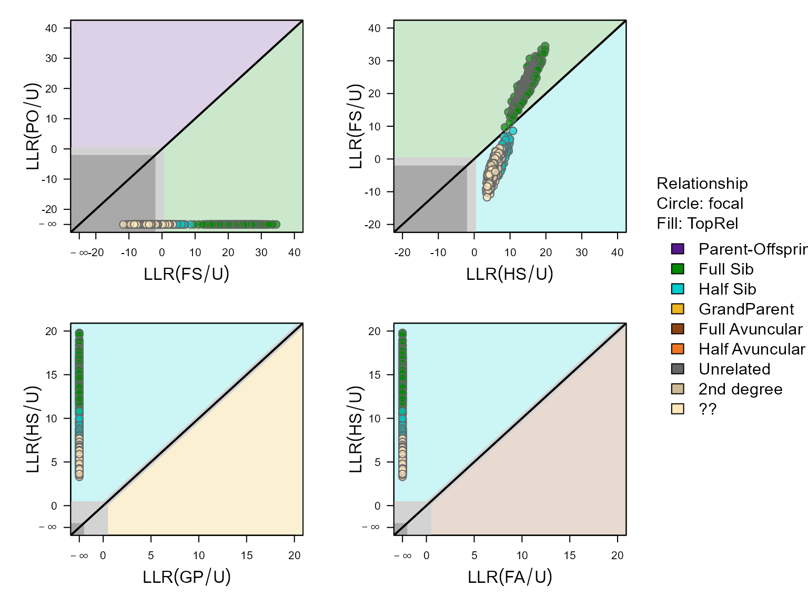
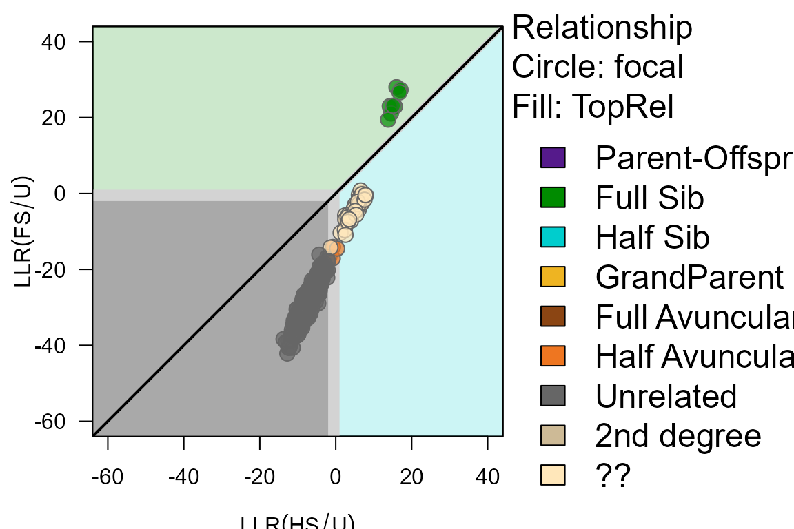
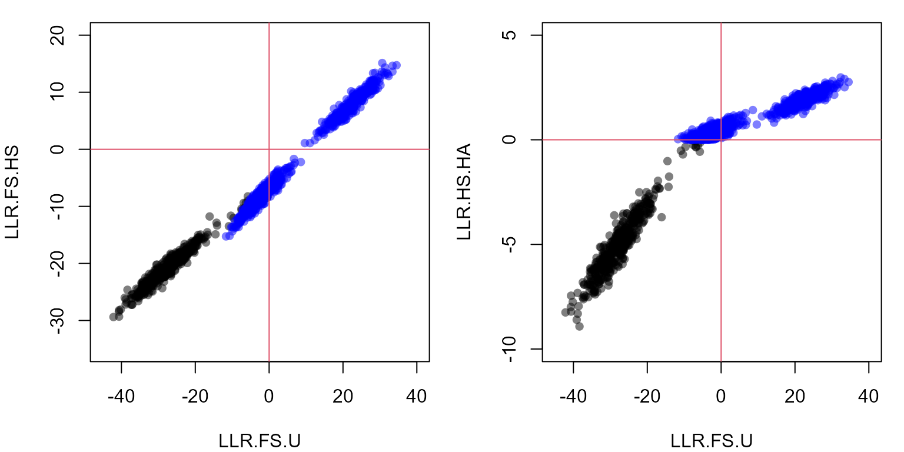
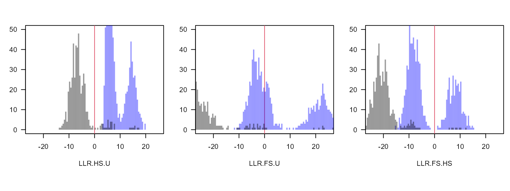
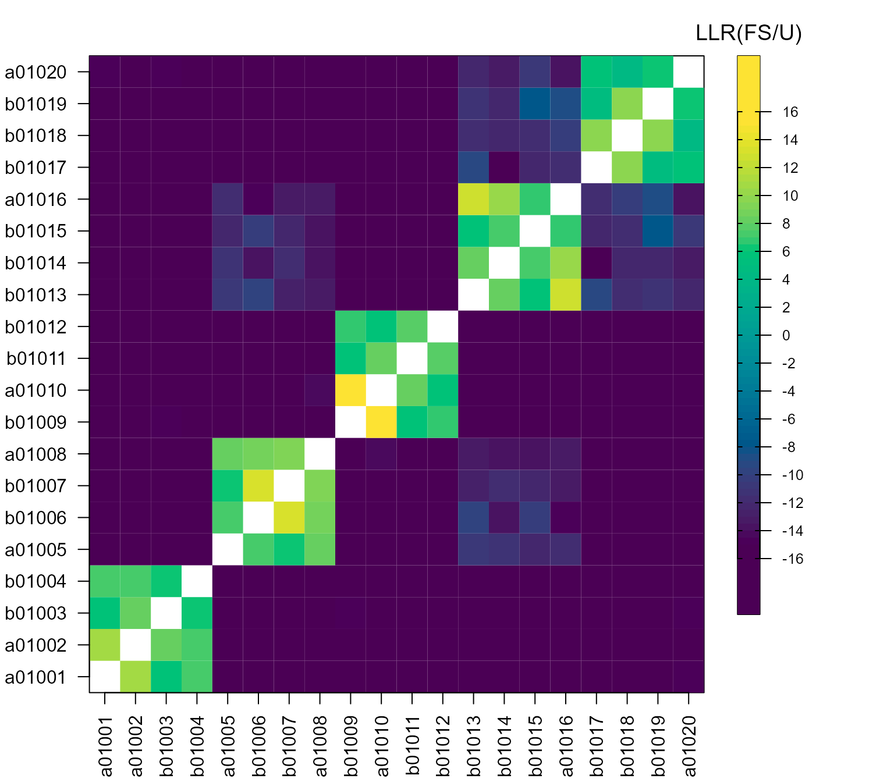

# Classification of pairs using likelihoods

------------------------------------------------------------------------

## Introduction

Pedigree reconstruction with
[`sequoia()`](https://jiscah.github.io/reference/sequoia.md) sometimes
suffers from high rates of non-assignment of true relatives (false
negatives). This is often because it cannot tell whether a pair are
maternal or paternal relatives, or it cannot tell what type of second
degree relatives they are. More information on this can be found [here
in the user
guide](https://jiscah.github.io/articles/vignette_main/book/key-points.html#sec:lowAR)).

A fairly common situation is to have full sibling (FS), half sibling
(HS), or unrelated (U) as the only three plausible relationships among
the genotyped individuals, e.g. when nestlings are sampled but their
parents are not. Typically none of the half sibling pairs will be
assigned by
[`sequoia()`](https://jiscah.github.io/reference/sequoia.md), as it
cannot tell whether they are maternal or paternal half-siblings. When
generations overlap, the possibility that they are full avuncular or
grandparental also remains open genetically, even if this is
biologically highly unlikely for clutch mates (for most species).

In such a situation, the likelihoods to be FS, HS, and U are the only
three that are relevant, but there is no good way during pedigree
reconstruction to set the prior for all other relationships to zero
(including e.g. full cousins) and to abandon the distinction between
maternal and paternal relatives (only implemented for hermaphrodites).

### Likelihood ratios

The function
[`CalcPairLL()`](https://jiscah.github.io/reference/CalcPairLL.md) lets
you get ‘back to basics’ and returns the log10-likelihoods for various
different relationships for each of the specified pairs of individuals.
The log10-likelihood values in its output cannot be directly compared
between pair: they differ because their genotypes differ. The likelihood
*ratios* however are on a comparable scale between individuals, e.g. the
ratio between how likely it is to be full siblings versus half sibling,
or half sibling versus unrelated.

### CAUTION

Comparisons between pairs should be done with caution: If pair A + B has
a higher LLR(PO/U) than pair A + C, this does not necessarily make B a
more likely parent of A than C. Both pairs may be parent-offspring
(e.g. C parent of A, A parent of B), or B may actually be a full sibling
(LLR(PO/U) \> 0, but LLR(PO/FS) \< 0).

### Applicable to other relationships

Here the example of full siblings, half siblings and unrelated is used,
but one could also have a situation where parent and full avuncular are
the alternatives, or any other combination. Just keep in mind that all
3rd degree relationships are piled together under the ‘HA’ category, and
that when `Complx='full'` all kinds of [double
relationships](https://jiscah.github.io/articles/vignette_main/book/key-points.html#sec:WeirdRels)
are considered too.

## With or without pedigree

The likelihood ratio full sibling vs unrelated (LR(FS/U)) between two
individuals can be calculated ignorant of the pedigree, or conditional
on it. The latter increases power if individual A already has siblings,
as the calculated LR is between B being a full (or half) sibling of A
*and all A’s siblings*, versus being unrelated to A’s sibling cluster.
This is similar as to what happens during sibship clustering, except
that instead of gradually building up sibship clusters, the sibling
clusters are provided at initiation.

The caveat is that
[`CalcPairLL()`](https://jiscah.github.io/reference/CalcPairLL.md) does
not check whether the provided pedigree is a correct or even plausible
pedigree. If some of the supposed siblings of A are in fact unrelated,
the LR between B and A conditional on the incorrect pedigree becomes
ambiguous and virtually useless. It is therefore prudent to check and if
necessary trim a pedigree before conditioning on it (e.g. using
[`CalcOHLLR()`](https://jiscah.github.io/reference/CalcOHLLR.md), or
removing any inconsistencies between genetic and field pedigree).

Here the approach will first be illustrated without conditioning on a
pedigree, and then conditional on a pedigree.

## Example data

To illustrate we use a single birth year cohort from the `Ped_HSg5`
example pedigree in the package. This pedigree has discrete generations,
and each generation 24 females mates with 2 males each, and 16 males
with 3 females each; each mating produces exactly 4 offspring. All
founders are born in 2000, the parents for the 2001 cohort considered
here are thus all simulated as unrelated.

This could for example be an egg-laying species were females have two
broods per year, and 4 eggs/hatchlings per brood are sampled for
genotyping. If egg dumping does not occur \[^a\], half-siblings within
the same brood will always be maternal half-siblings, and half-siblings
across different broods laid at the same time will be paternal
half-siblings. With egg dumping, the puzzle becomes a bit more
complicated but not necessarily impossible to solve

``` r
# looking at 2001 'hatchlings' only. 
Ped.2001 <- Ped_HSg5[Ped_HSg5$id %in% LH_HSg5$ID[LH_HSg5$BirthYear <= 2001], ]
# total 192 individuals, across 24 dams x 16 sires

# simulate genetic data:
Geno.2001 <- SimGeno(Pedigree = Ped.2001, 
                     ParMis = 1.0,     # all parents non-genotyped
                     nSnp = 400, SnpError = 0.005)
```

### Find pairs of likely relatives

To reduce computational time (and memory size of the output object), it
is often a good idea to only calculate likelihoods for pairs that are
somewhat likely to be related. In this moderately sized example with 192
genotyped individuals, there are $`(192 \times 191)/2= 18336`$ unique
pairs. Even when every individual belongs to a sibship, most pairs of
individuals are unrelated:

``` r
# matrix with type of relationship between each pair of individuals in a pedigree:
RelM <- GetRelM(Ped.2001)

# Note: GetRelM() adds entries for all parents, using PedPolish()
# removing those again...:
SampleIDs <- rownames(Geno.2001)
RelM <- RelM[match(SampleIDs, rownames(RelM)), match(SampleIDs, rownames(RelM))] 

# each pair is included twice in the matrix: above & below the diagonal
table(RelM)/2
```

    ## RelM
    ##    FS    HS     S     U 
    ##   320  1088    96 16928

thus, 33856 of these pairs are unrelated (U), or 92%.

Subsetting pairs can be done based on field data (e.g. only check
within-nest, or among neighbouring nests), or based on the genetic data.
For the latter, use
[`GetMaybeRel()`](https://jiscah.github.io/reference/GetMaybeRel.md),
optionally with a much more liberal threshold than you would normally
use.

``` r
# make mock lifehistory data for this example:
# all individuals same birth year + specifying non-overlapping generations
# ensures that parent-offspring, aunt/uncle, etc. are not considered as 
# relationship alternatives. 
LHX <- data.frame(id = rownames(Geno.2001),
                  Sex = 3,
                  BirthYear = 1)

AP <- MakeAgePrior(Discrete=TRUE, Plot=FALSE)
```

    ## ℹ Ageprior: Flat 0/1, discrete generations, MaxAgeParent = 1,1

``` r
MR <- GetMaybeRel(Geno.2001,
                  LifeHistData = LHX,
                  AgePrior = AP,
                  Module = "ped",   # search for all kinds of relatives, not just parent-offspring
                  Complex = "simp",  # don't consider double relationships etc
                  Err = 0.005,
                  Tassign = 0.1,
                  Tfilter = -5,
                  MaxPairs = 20 * nrow(Geno.2001))
```

    ## ℹ Searching for non-assigned relative pairs ... (Module = ped)

    ## ✔ Genotype matrix looks OK! There are  192  individuals and  400  SNPs.

    ## ℹ Not conditioning on any pedigree

    ## Counting opposing homozygous loci between all individuals ...
    ## Checking for non-assigned relatives ...
    ##  0   10  20  30  40  50  60  70  80  90  100% 
    ##  |   |   |   |   |   |   |   |   |   |   |
    ##   ****************************************

    ## ✔ Found 0 likely parent-offspring pairs, and 857, other non-assigned pairs of possible relatives

``` r
head(MR$MaybeRel)
```

    ##      ID1    ID2 TopRel   LLR OH BirthYear1 BirthYear2 AgeDif Sex1 Sex2 SNPdBoth
    ## 1 a01062 a01063     FS 15.84 12          1          1      0    3    3      391
    ## 2 a01071 b01072     FS 15.55  2          1          1      0    3    3      391
    ## 3 a01163 a01192     FS 13.84  6          1          1      0    3    3      389
    ## 4 a01062 b01064     FS 13.62 12          1          1      0    3    3      394
    ## 5 b01161 a01163     FS 13.24  3          1          1      0    3    3      389
    ## 6 a01162 a01192     FS 13.08  9          1          1      0    3    3      392

The output from GetMaybeRel only shows the most likely relationship (for
these 6 it is full sibling (`TopRel = FS`), and how much more likely
this is than the next-most-likely relationship (column `LLR`). It does
not show what the next-most-likely relationship is, or how much more
likely these pairs are to be full siblings versus unrelated. Some pairs
may be about equally likely to be full siblings as half-siblings,
resulting in a low LLR, but it does not show how much more likely both
sibling categories are versus unrelated.

### Calculate likelihoods

``` r
PairLL <- CalcPairLL(data.frame(MR$MaybeRel[, c("ID1", "ID2")],
                                focal = "U"),  # see help file for details
                     Geno.2001,
                     LifeHistData = LHX,
                     AgePrior = AP,
                     Complex = "simp",
                     Err = 0.005)
```

    ## ℹ Not conditioning on any pedigree

    ##  0   10  20  30  40  50  60  70  80  90  100% 
    ##  |   |   |   |   |   |   |   |   |   |   |
    ##   ****************************************



The upper-right panel (LLR(FS/U) vs LLR(HS/U)) shows that there are a
large number of pairs in this dataset that are clearly full siblings
(above diagonal), and a number that are likely half-siblings (blue
dots), but also a substantial number that seem to be some kind of second
or third degree relative but it is unclear how they are exactly related
(yellow dots).

The difference between the likely half-siblings and ‘unclear’ is not
obvious in the above plot, but comes about via the likelihood ratio
between half-siblings versus third degree relative (see further).

For contrast, let’s also calculate likelihoods for a random set of
pairs:

``` r
Pairs.random <- data.frame(ID1 = sample(SampleIDs, size=500, replace=TRUE),
                           ID2 = sample(SampleIDs, size=500, replace=TRUE),
                           focal = "U")
# exclude if by chance ID1 == ID2
Pairs.random <- Pairs.random[Pairs.random$ID1 != Pairs.random$ID2, ]
  
Pairs.random.LL <- CalcPairLL(Pairs.random, 
                     Geno.2001,
                     LifeHistData = LHX,
                     AgePrior = AP,
                     Complex = "simp",
                     Err = 0.005, Plot=FALSE)
```

    ## ℹ Not conditioning on any pedigree

    ##  0   10  20  30  40  50  60  70  80  90  100% 
    ##  |   |   |   |   |   |   |   |   |   |   |
    ##   ****************************************

``` r
# plot only one panel, change assignment threshold 
PlotPairLL(Pairs.random.LL, combo = list(c("HS", "FS")), Tassign=1.0)
```



For these random pairs, there is (usually) a clear divide between full
siblings (above diagonal), half-siblings (below diagonal &
LLR(HS/U)$`>0`$), and unrelated (LLR(HS/U)$`<0`$).

### Likelihood ratios

Remember that

``` math

\log(A / B) = \log(A) - \log(B)
```
and that
[`CalcPairLL()`](https://jiscah.github.io/reference/CalcPairLL.md)
returns log10-likelihood values. Log-likelihood values are always
negative, as likelihoods are always between 0 and 1; positive values in
the output are various types of `NA` (see help file).

``` r
PList <- list(maybesibs = PairLL,
              random = Pairs.random.LL)

for (x in c("maybesibs", "random")) {
  PList[[x]]$LLR.FS.U <- with(PList[[x]], ifelse(FS < 0, FS - U, NA))
  PList[[x]]$LLR.HS.U <- with(PList[[x]], ifelse(HS < 0, HS - U, NA))
  PList[[x]]$LLR.FS.HS <- with(PList[[x]], ifelse(FS < 0 & HS < 0, FS - HS, NA)) 
  PList[[x]]$LLR.HS.HA <- with(PList[[x]], ifelse(HS < 0 & HA < 0, HS - HA, NA)) 
}
```

``` r
par(mfcol=c(1,2), mai=c(.8,.8,.2,.2))

with(PList[["random"]], plot(LLR.FS.U, LLR.FS.HS, pch=16,
                             xlim = c(-45, 40), ylim=c(-35, 20),
                             col=adjustcolor("black", alpha.f=0.5)))  # semi-transparant
with(PList[["maybesibs"]], points(LLR.FS.U, LLR.FS.HS, pch=16, 
                                  col=adjustcolor("blue", alpha.f=0.5)))
abline(h=0, v=0, col=2)  # horizontal & vertical axis

with(PList[["random"]], plot(LLR.FS.U, LLR.HS.HA, pch=16, 
                             xlim=c(-45,40), ylim=c(-10,5), 
                             col=adjustcolor("black", alpha.f=0.5)))
with(PList[["maybesibs"]], points(LLR.FS.U, LLR.HS.HA, pch=16, 
                                  col=adjustcolor("blue", alpha.f=0.5)))
abline(h=0, v=0, col=2)  # horizontal & vertical axis
```



These scatterplots are the similar to the ones before, but in the left
panel LLR(FS/HS) is on the y-axis: those pairs more likely to be full
sibling than half sibling have positive values, and the remaining pairs
negative values; and analogous for LLR(HS/HA) in the right panel.

The panels show three distinct blobs: full sibling, half sibling, and
unrelated pairs. There are (usually) however also a number of points
in-between the blobs: pairs for which it is unclear how they are
related. For the pairs in-between the full- and half-sib blob, it is
clear that they are some kind of sibling, and definitely not unrelated;
but the pedigree reconstruction with
[`sequoia()`](https://jiscah.github.io/reference/sequoia.md) has no way
to convert this information and leaves such a pair unassigned.

Comparing the two panels also shows that while the different likelihood
ratios are all strongly correlated, they do convey slightly different
information: the separation between full siblings and half siblings is
clearer with LLR(FS/HS) (left panel y-axis), while the separation
between half siblings and not-siblings is clearer with LLR(HS/HA) (right
panel y-axis).

The distributions of likelihood ratios can also be visualised as a set
of histograms:

``` r
# to draw multiple histograms in the same plot: calculate first, plot later
HistL_FSU <- list()
for (x in c("maybesibs", "random")) {
  HistL_FSU[[x]] <- list()
  for (y in c("LLR.HS.U", "LLR.FS.U", "LLR.FS.HS")) {
    HistL_FSU[[x]][[y]] <- hist(PList[[x]][, y],
                                breaks=seq(-60, 60, by=0.5),   
                                plot=FALSE)  
  }
}

# pick some colours
COL <- c(maybesibs = adjustcolor("blue",alpha.f=0.4),
         random = adjustcolor("black",alpha.f=0.4))

par(mfcol=c(1,3), mai=c(.9,.4,.4,.1))
for (y in c("LLR.HS.U", "LLR.FS.U", "LLR.FS.HS")) { 
  plot(1,1, type="n", main="", xlab=y, ylab="Count", las=1,
       xlim = c(-25, 25), ylim=c(0,50))
  abline(v=0, col=2)
  for (x in c("maybesibs", "random")) {
    plot(HistL_FSU[[x]][[y]], col=COL[x], border=NA, add=TRUE)
  }
}
```



Again the distribution of LLR(FS/U) shows a fairly clear separation
between full siblings (LLR(FS/U) \> 10), half siblings (-15 \< LLR(FS/U)
\< 10) and unrelated (LLR(FS/U) \< -15), and is strongly correlated with
LLR(FS/HS) (see scatterplot above). The main advantage of using
LLR(FS/HS) to classify full vs half siblings is a practical one: the
point of separation between the blobs (if there is one) will always be
at 0. For LLR(HS/U), LLR(FS/U) and similar metrics the point of
separation will vary between datasets with the number of SNPs, (assumed)
genotyping error rate, allele frequencies, missingness, …, and a
threshold would need to be estimated every time.

A heatmap may also be helpful to identify *which* pairs of relatives are
likely to be full or half siblings. There are several ways to make a
heatmap in R (none I find quite satisfactory), for example:

``` r
# using the first 20 individuals for this example
# make a dataframe with all pairwise combinations:
Pairs20 <- data.frame(ID1 = rep(SampleIDs[1:20], each=20),
                      ID2 = rep(SampleIDs[1:20], times=20))
Pairs20 <- Pairs20[Pairs20$ID1 != Pairs20$ID2, ] 

Pairs20.LL <- CalcPairLL(Pairs20, 
                         Geno.2001,
                         LifeHistData = LHX,
                         AgePrior = AP,
                         Complex = "simp",
                         Err = 0.005, Plot=FALSE)
```

    ## ℹ Not conditioning on any pedigree

    ##  0   10  20  30  40  50  60  70  80  90  100% 
    ##  |   |   |   |   |   |   |   |   |   |   |
    ##   ****************************************

``` r
Pairs20.LL$FS.HS <- with(Pairs20.LL, ifelse(FS < 0 & HS < 0, FS - HS, NA))  
```

``` r
# turn dataframe into a matrix
FSHS.M <- plyr::daply(Pairs20.LL, c("ID1", "ID2"), function(df) df$FS.HS[1])
# put the individuals back into their original order:
FSHS.M <- FSHS.M[SampleIDs[1:20], SampleIDs[1:20]]

brks <- c(-30, seq(-15, 15, by=0.5), 30)  # group everything < -15 or >15 together
cols <- grDevices::hcl.colors(n = length(brks)-1, palette = "viridis")

# image() is simple and flexible, but doesn't do a legend
image_legend <- function(x, legend, breaks, col, title = NULL) {
  image(y=x, z=t(as.matrix(x)),
        axes=FALSE, frame.plot=TRUE, breaks = breaks, col = col)
  axis(side=4, at=legend, las=1, cex.axis=0.8)
  axis(side=4, at=legend, labels=FALSE, tck=0.2)
  axis(side=2, at=legend, labels=FALSE, tck=0.2)
  mtext(title, side=3, line=0.5, cex=1.2)  
}

layout(matrix(c(1,2), nrow=1), widths=c(.8, .2))
par(mai=c(.8,.8,.5,.1))

image(x=t(FSHS.M), breaks=brks, col = cols,
      axes = FALSE, frame.plot=TRUE,
      xlab = "", ylab = "", cex.lab=1.2)
axis(side=1, labels=rownames(FSHS.M), at=seq(0,1,along.with=rownames(FSHS.M)), las=2)
axis(side=2, labels=colnames(FSHS.M), at=seq(0,1,along.with=colnames(FSHS.M)), las=2)

par(mai=c(1.5,.2,.5,1.2))
image_legend(x = seq(-20, 19.5, .5) +.25,  # range of values 
             legend = seq(-16, 16, 2),     # positions of legend labels
             breaks = brks, col = cols, title = "LLR(FS/U)")
```



### Buffer zone

While the *expectation* is that LLR(FS/HS) is positive for all full
sibling pairs and negative for all other pairs, this does not mean that
in imperfect real-world data all pairs will comply with this
expectation. The solution that
[`sequoia()`](https://jiscah.github.io/reference/sequoia.md) implements
is to not make an assignment if the likelihood ratio ‘close’ to zero,
with ‘close’ defined by the threshold `Tassign`.

This may not be ideal in all situations, and you could apply a different
tactic when classifying individuals based on the
[`CalcPairLL()`](https://jiscah.github.io/reference/CalcPairLL.md)
output (see next section). For example, if you are sure based on other
data that pairs are either full siblings or maternal half-siblings and
never paternal half-siblings (e.g. they are litter mates), you could
assign the maternal sibship but leave the paternity open (perhaps with a
note). Or if you are interested in extra-pair paternity, you could be
conservative and assign these as full siblings to the rest of the brood
(see also the next section, and the section on [conditioning on the
pedigree](#sec:withPedigree)).

``` r
Tassign <- 1.0

plot(HistL_FSU[["maybesibs"]][["LLR.FS.HS"]], col="darkblue", border=NA,
     xlim = c(-15, 15), ylim = c(0, 30), main=paste("Tassign =", Tassign), 
     xlab="LLR(FS/HS)")
abline(v=0, lwd=2, col=2)
rect(xleft=-Tassign, xright=+Tassign, ybottom=-5, ytop=40, 
     col=adjustcolor("red", alpha.f=0.5), border=NA)
```


### Classify

Classifying pairs of individuals at a given assignment threshold
`Tassign` is straightforward:

``` r
Tassign <- 0.5
for (x in c("maybesibs", "random")) {
  PList[[x]]$class <- with(PList[[x]],
                           ifelse(LLR.FS.HS > Tassign, "FS",
                                  ifelse(LLR.HS.U > Tassign, "HS",
                                         "U")))
}

lapply(PList, function(df) table(df$class))
```

    ## $maybesibs
    ## 
    ##  FS  HS 
    ## 318 539 
    ## 
    ## $random
    ## 
    ##  FS  HS   U 
    ##   5  23 467

Classifying sibling clusters is less straightforward, as the pairwise
classifications are not necessarily consistent. For example, in the
figure individuals A and B are highly likely to be full siblings, and so
are A and C (at $`T_{assign}=0.5`$), but B and C are more likely to be
half-siblings.


Example LLR(FS/HS) for a putative full sibling trio

The problem arises because the likelihoods of the three pairs are
calculated independently of each other. During pedigree reconstruction,
the problem is resolved by first assigning A and B as full siblings
(which is unambiguous), and then calculating the likelihoods for C to be
a full sibling vs half sibling to *both* A and B: *Conditional* on A and
B being full siblings, C being a full sibling to one but not the other
is not a valid pedigree configuration.

## Conditioning on a pedigree

In datasets like this example, with a mixture of full- and half-siblings
and no genotyped parents, usually clustering of full siblings is
performed OK via
[`sequoia()`](https://jiscah.github.io/reference/sequoia.md), but none
of the half-siblings are assigned because it cannot tell whether they
are maternal or paternal half-siblings.

So, first run the sibship clustering. As we will condition on this
pedigree in the subsequent steps, we are being extra cautious and
increase the assignment threshold:

``` r
SeqOUT <- sequoia(Geno.2001, LifeHistData = LHX,
                  Err = 0.005, Tassign = 1.0,  
                  Complex = "simp", Module="ped", 
                  Plot=FALSE, quiet=TRUE)
```

### Relationship between individual & cluster

When you provide a pedigree to
[`CalcPairLL()`](https://jiscah.github.io/reference/CalcPairLL.md), all
calculations will be conditional on this pedigree. This means it does
not matter if you calculate the likelihoods A–C or B–C in the trio
example; both will calculate the likelihoods of relationships between C
and the A–B sibling duo.

To illustrate:

``` r
# true pedigree, 2 broods from 1 female:
Ped.2001[which(Ped.2001$dam == "a00014"), ]
```

    ##         id    dam   sire
    ## 41  a01001 a00014 b00011
    ## 42  a01002 a00014 b00011
    ## 43  b01003 a00014 b00011
    ## 44  b01004 a00014 b00011
    ## 225 a01185 a00014 b00008
    ## 226 a01186 a00014 b00008
    ## 227 b01187 a00014 b00008
    ## 228 b01188 a00014 b00008

``` r
Offspr_a14 <- Ped.2001[which(Ped.2001$dam == "a00014"), "id"]
```

``` r
# inferred pedigree:
SeqOUT$Pedigree[SeqOUT$Pedigree$id %in% Offspr_a14, ]
```

    ##         id   dam  sire LLRdam LLRsire LLRpair OHdam OHsire MEpair
    ## 1   a01001 F0037 M0037     NA      NA      NA    NA     NA     NA
    ## 2   a01002 F0037 M0037     NA      NA      NA    NA     NA     NA
    ## 3   b01003 F0037 M0037     NA      NA      NA    NA     NA     NA
    ## 4   b01004 F0037 M0037     NA      NA      NA    NA     NA     NA
    ## 185 a01185 F0044 M0044     NA      NA      NA    NA     NA     NA
    ## 186 a01186 F0044 M0044     NA      NA      NA    NA     NA     NA
    ## 187 b01187 F0044 M0044     NA      NA      NA    NA     NA     NA
    ## 188 b01188 F0044 M0044     NA      NA      NA    NA     NA     NA

To reiterate: the maternal sibship is divided into two sets of full
siblings because
[`sequoia()`](https://jiscah.github.io/reference/sequoia.md) has no way
of telling whether they share the same mother or the same father. This
distinction can only be made when some parents of known sex are
genotyped and the sibships interconnect: e.g. if male ‘b00008’ also
mated with another female, who in turn also mated with a genotyped male
(see also section on low assignment rate in main vignette).

Let’s calculate the likelihoods between the four members of the first
brood and the first member of the second brood. For a meaningful answer,
we temporarily drop both parents of the second individual
(`dropPar2 = 'both'`): if two individuals have two different sets of
parents, they cannot be siblings *conditional on those parents*. Now we
calculate the likelihood that ‘a01185’ is a full sibling of half sibling
to all of the first brood; if we had chosen `dropPar1='both'` we would
calculate the likelihood of each member of the first brood being FS, HS,
.. to the second brood.

``` r
somePairs <- data.frame(ID1 = Offspr_a14[1:4],
                        ID2 = "a01185",
                        focal = "HS",
                        dropPar2 = "both")  # drop parents of ID2

somePairs.LL <- CalcPairLL(somePairs, Geno.2001,
                           Pedigree = SeqOUT$Pedigree,
                           Complex="simp",
                           Err = 0.005, Plot=FALSE)
```

    ## ℹ Conditioning on pedigree with 284 individuals, 192 dams and 192 sires

    ## Transferring input pedigree ...

``` r
somePairs.LL
```

    ##      ID1    ID2 Sex1 Sex2 AgeDif focal patmat dropPar1 dropPar2      PO      FS
    ## 1 a01001 a01185    3    3     NA    HS      1     none     both -326.68 -327.64
    ## 2 a01002 a01185    3    3     NA    HS      1     none     both -345.47 -334.02
    ## 3 b01003 a01185    3    3     NA    HS      1     none     both -336.43 -330.97
    ## 4 b01004 a01185    3    3     NA    HS      1     none     both -321.72 -324.08
    ##        HS      GP      FA      HA       U TopRel  LLR
    ## 1 -292.70 -297.36 -292.70 -293.46 -297.91    2nd 0.76
    ## 2 -299.09 -301.90 -299.09 -299.84 -304.29    2nd 0.76
    ## 3 -296.03 -300.09 -296.03 -296.79 -301.24    2nd 0.76
    ## 4 -289.14 -291.75 -289.14 -289.90 -294.35    2nd 0.76

For each pair, the likelihoods to be half-siblings (HS), grand-parental
(GP) or full avuncular (FA) will be identical – another common [cause
for
non-assignment](https://jiscah.github.io/articles/vignette_main/book/key-points.html#sec:lowAR)

Note again that values \>0 in the output denote different kinds of `NA`,
and are listed in the help file. For the ‘PO’ column, ‘777’ denotes
‘impossible’: the individuals in the first column already have a mother
assigned in the pedigree that is conditioned upon, this parent is not
temporarily dropped to do the calculations (`dropPar = 'none'`), and an
individual can only have one mother. (the pair were also born in the
same year and can therefore not be parent and offspring, but this
information is not used: `AgeDif=NA`.)

### Likelihood ratios

The likelihoods differ between the pairs (because they have different
genotypes), but the likelihood *ratios* do not (except due to rounding):

``` r
somePairs.LL$LLR.FS.HS <- with(somePairs.LL, ifelse(FS < 0 & HS < 0, FS - HS, NA))
somePairs.LL$LLR.HS.U <- with(somePairs.LL, ifelse(HS < 0, HS - U, NA))
somePairs.LL$LLR.HS.HA <- with(somePairs.LL, ifelse(HS < 0 & HA < 0, HS - HA, NA))

somePairs.LL[, c("ID1", "ID2", "FS", "HS", "HA", "U", "LLR.FS.HS", "LLR.HS.U", "LLR.HS.HA")]
```

    ##      ID1    ID2      FS      HS      HA       U LLR.FS.HS LLR.HS.U LLR.HS.HA
    ## 1 a01001 a01185 -327.64 -292.70 -293.46 -297.91    -34.94     5.21      0.76
    ## 2 a01002 a01185 -334.02 -299.09 -299.84 -304.29    -34.93     5.20      0.75
    ## 3 b01003 a01185 -330.97 -296.03 -296.79 -301.24    -34.94     5.21      0.76
    ## 4 b01004 a01185 -324.08 -289.14 -289.90 -294.35    -34.94     5.21      0.76

Compare these to the ratios when not conditioning on a pedigree:

``` r
somePairs.LL.noped <- CalcPairLL(somePairs, Geno.2001,
                           Complex="simp",
                           Err = 0.005, Plot=FALSE)
```

    ## ℹ Not conditioning on any pedigree

``` r
somePairs.LL.noped$LLR.FS.HS <- with(somePairs.LL.noped, ifelse(FS < 0 & HS < 0, FS - HS, NA))
somePairs.LL.noped$LLR.HS.U <- with(somePairs.LL.noped, ifelse(HS < 0, HS - U, NA))
somePairs.LL.noped$LLR.HS.HA <- with(somePairs.LL.noped, ifelse(HS < 0 & HA < 0, HS - HA, NA))

somePairs.LL.noped[, c("ID1", "ID2", "FS", "HS", "HA", "U", "LLR.FS.HS", "LLR.HS.U", "LLR.HS.HA")]
```

    ##      ID1    ID2      FS      HS      HA       U LLR.FS.HS LLR.HS.U LLR.HS.HA
    ## 1 a01001 a01185 -343.96 -332.13 -331.90 -335.49    -11.83     3.36     -0.23
    ## 2 a01002 a01185 -354.38 -341.39 -340.64 -342.69    -12.99     1.30     -0.75
    ## 3 b01003 a01185 -344.35 -332.17 -331.49 -333.29    -12.18     1.12     -0.68
    ## 4 b01004 a01185 -341.84 -327.91 -327.58 -329.96    -13.93     2.05     -0.33

### Half-sibling clusters

For a pair of maternal half-siblings A and B, a third individual C must
be identically related to both, but only ‘at that side of the family’:
If C is a maternal grandmother to A, it is unavoidably also the maternal
grandmother of B. But if C is the *paternal* grandmother of A, it could
be unrelated to B. This distinction can be made via the `patmat` column.

### random pairs revisited

Calculating likelihoods for the same subset of pairs as before, now
conditional on the inferred (partial) pedigree:

``` r
Pairs.random.LL.wPed <- CalcPairLL(Pairs = cbind(Pairs.random,
                                            dropPar2 = "both"),
                              Geno.2001,
                              Pedigree = SeqOUT$Pedigree,
                              LifeHistData = LHX,
                              AgePrior = AP,
                              Complex = "simp",
                              Err = 0.005, Plot=FALSE)
```

    ## ℹ Conditioning on pedigree with 284 individuals, 192 dams and 192 sires

    ## Transferring input pedigree ...
    ##  0   10  20  30  40  50  60  70  80  90  100% 
    ##  |   |   |   |   |   |   |   |   |   |   |
    ##   ****************************************

``` r
Pairs.random.LL$LLR.FS.HS <- with(Pairs.random.LL, 
                                  ifelse(FS < 0 & HS < 0, FS - HS, NA))
Pairs.random.LL.wPed$LLR.FS.HS <- with(Pairs.random.LL.wPed, 
                                        ifelse(FS < 0 & HS < 0, FS - HS, NA))

par(mfcol=c(1,2), mai=c(.8,.8,.2,.2))
hist(Pairs.random.LL$LLR.FS.HS, breaks=50, main="No pedigree")
hist(Pairs.random.LL.wPed$LLR.FS.HS, breaks=50, main="With pedigree")
```


Log10 likelihood ratios full sibling vs half sibling, calculated without
pedigree (left) and conditional on a partial inferred pedigree (right).
Note difference in scale on the x-axes.

### Pros & cons

The main advantage of calculating likelihoods conditional on a pedigree
is that the distinction between different relationships tends to become
much clearer once you condition on at least one parent for either
individual.

The main disadvantage is that if the pedigree you condition on is
incorrect, there is no meaningful way to interpret the likelihoods.

Another disadvantage can be that computation is considerably slower
(order of magnitudes), making it more important to filter pairs first
using
[`GetMaybeRel()`](https://jiscah.github.io/reference/GetMaybeRel.md).
