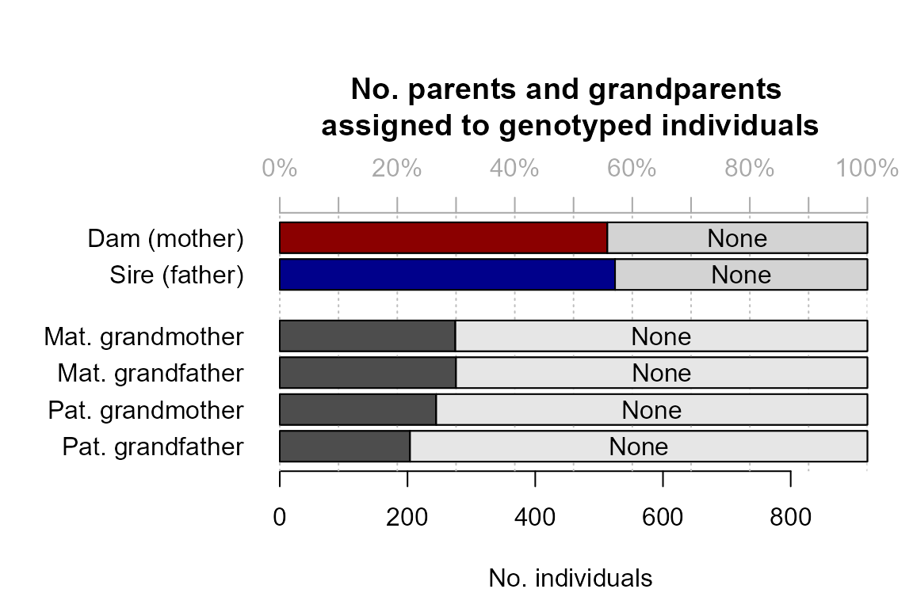
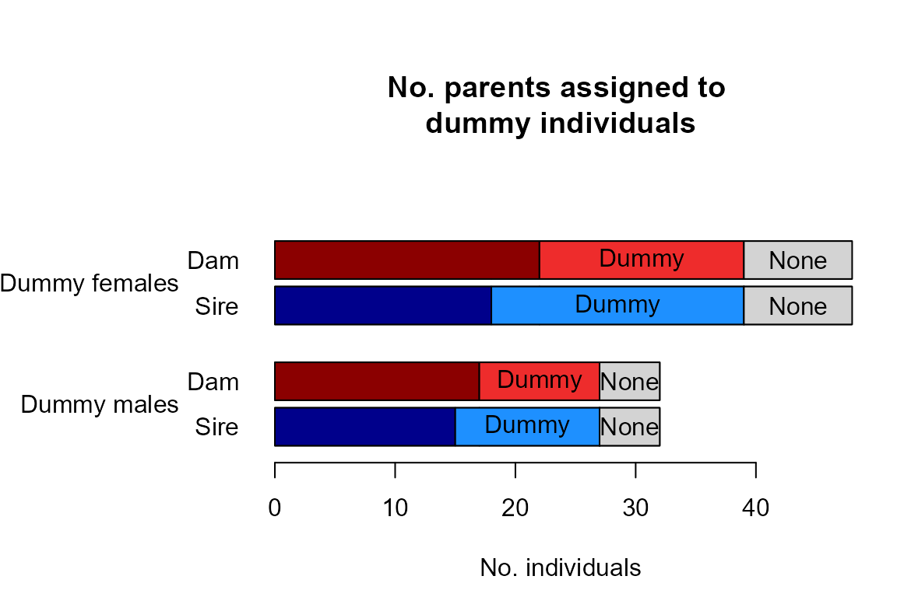

# Quick start example 1: Simulated data

## Quick start example 1: Simulated data

### Get started

*For a succinct version of this example where you can copy/paste all
code in one go, see the main vignette*

In this example genotypes are simulated from a fictional pedigree, which
together with the associated life history data is provided with the
package. This pedigree consists of 5 discrete generations with
interconnected half-sib clusters (Pedigree II in the paper[¹](#fn1)).

``` r
# Install the package. This is only the required the first time, or if you wish to update
# install.packages("sequoia")   

# Load the package. This is required at the start of every new R session.
library(sequoia) 

# Load the example pedigree and life history data
data(Ped_HSg5, LH_HSg5)

# Take a look at the data structure
tail(Ped_HSg5)
head(LH_HSg5)

# or, in Rstudio, view the full dataframe:
View(Ped_HSg5)
```

### Simulate genotypes

Simulate some genotype data to use for this try-out.

``` r
Geno <- SimGeno(Ped = Ped_HSg5, nSnp = 200)
```

Function [`SimGeno()`](https://jiscah.github.io/reference/SimGeno.md)
can simulate data with a specific genotyping error rate, call rate and
proportion of non-genotyped parents, see its helpfile
([`?SimGeno`](https://jiscah.github.io/reference/SimGeno.md)) for
details. Here we use the defaults; 40% of parents are presumed
non-genotyped (their genotypes are removed from the dataset before
[`SimGeno()`](https://jiscah.github.io/reference/SimGeno.md) returns its
result).

Alternatively, use the simulated genotype data included in the package
to get identical results:

``` r
Geno <- Geno_HSg5
```

### Parentage assignment

Run sequoia with the genotype data, lifehistory data, and otherwise
default values. It is often advisable to first only run parentage
assignment, and check if the results are sensible and/or if any
parameters need adjusting. Full pedigree reconstruction, including
sibship clustering etc., is much more time consuming.

To only run a data check, duplicate check (always performed first) and
parentage assignment, specify `Module = 'par'`:

``` r
ParOUT <- sequoia(GenoM = Geno,
                  LifeHistData = LH_HSg5,
                  Module = 'par')
```

    ## ℹ Checking input data ...


    ## ! There are 2 SNPs scored for <50% of individuals

    ## ℹ There are  920  individuals and  200  SNPs.

    ## 

    ## ── Among genotyped individuals: ___

    ## ℹ There are 467 females, 453 males, 0 of unknown sex, and 0 hermaphrodites.

    ## ℹ Exact birth years are from 2000 to 2005

    ## ___

    ## ℹ Calling `MakeAgePrior()` ...

    ## ℹ Ageprior: Flat 0/1, overlapping generations, MaxAgeParent = 6,6


    ## 
    ## ~~~ Duplicate check ~~~

    ## ✔ No potential duplicates found

    ## 
    ## ~~~ Parentage assignment ~~~

    ## 
    ##  Time    |  R |  Step      |  Progress  | Dams  | Sires |  GPs  |   Total LL 
    ## -------- | -- | ---------- | ---------- | ----- | ----- | ----- | ----------
    ## 15:57:54 |  0 | initial    |            |     0 |     0 |     0 |   -70880.7 
    ## 15:57:54 |  0 | parents    |            |   514 |   525 |     0 |   -57586.6

    ## ✔ assigned 514 dams and 525 sires to 920 individuals 
    ## 



You will see several plots appearing:

- Histograms of the minor allele frequency and missingness, produced by
  [`SnpStats()`](https://jiscah.github.io/reference/SnpStats.md), which
  is called by
  [`CheckGeno()`](https://jiscah.github.io/reference/CheckGeno.md) to
  make sure there are no monomorphic SNPs or SNPs with extremely high
  missingness in the dataset  
- Heatmap of the ageprior before parentage assignment, showing that an
  age difference of 0 years is disallowed ($`0`$, black) for mothers
  (*M*) and fathers (*P*), but all other age differences are allowed
  ($`1`$, pale green) for all relationships. The initial maximum age of
  parents is set to the maximum age difference found in the lifehistory
  data.  
- Barplots of assignment rate (produced by
  [`SummarySeq()`](https://jiscah.github.io/reference/SummarySeq.md)):
  nearly 60% of individuals have a genotyped parent assigned, in line
  with the 40% non-genotyped parents we simulated.

In addition, you will see several messages, including about the initial
and post-parentage total LL (log10-likelihood). This is the probability
of observing the genotype data, given the (current) pedigree; initially
it is assumed that all individuals are unrelated. This number is
negative, and gets closer to zero when the pedigree explains the data
better.

The result is a list, with the following elements:

``` r
names(ParOUT)
```

    ##  [1] "Specs"            "ErrM"             "args.AP"          "Snps-LowCallRate"
    ##  [5] "DupLifeHistID"    "NoLH"             "AgePriors"        "LifeHist"        
    ##  [9] "PedigreePar"      "TotLikPar"        "LifeHistPar"

which are explained in detail in the helpfile
([`?sequoia`](https://jiscah.github.io/reference/sequoia.md)) and the
main vignette.

you find the assigned parents in list element `PedigreePar`:

``` r
tail(ParOUT$PedigreePar)
```

    ##         id    dam   sire LLRdam LLRsire LLRpair OHdam OHsire MEpair
    ## 915 b05187 a04045   <NA>     NA      NA      NA     0     NA     NA
    ## 916 a05188 a04045   <NA>     NA      NA      NA     0     NA     NA
    ## 917 a05189   <NA> b04177     NA      NA      NA    NA      0     NA
    ## 918 b05190   <NA> b04177     NA      NA      NA    NA      0     NA
    ## 919 b05191   <NA> b04177     NA      NA      NA    NA      0     NA
    ## 920 b05192   <NA> b04177     NA      NA      NA    NA      0     NA

we can compare these to the true parents, in the original pedigree from
which we simulated the genotype data:

``` r
chk_par <- PedCompare(Ped1 = Ped_HSg5, Ped2 = ParOUT$PedigreePar)
```


``` r
chk_par$Counts["GG",,]   
```

    ##           parent
    ## class      dam sire
    ##   Total    537  544
    ##   Match    513  524
    ##   Mismatch   1    1
    ##   P1only    23   19
    ##   P2only     0    0

Here ‘GG’ stands for *G*enotyped offspring, *G*enotyped parent.

### Pedigree reconstruction

Then, we can run full pedigree reconstruction. By default, this re-runs
the parentage assignment.

``` r
SeqOUT_HSg5 <- sequoia(GenoM = Geno, LifeHistData = LH_HSg5, Module = "ped")
```

If you don’t want to re-run parentage assignment (e.g. because it took
quite a bit of time), or if you have specified several non-default
parameter values you want to use again, , you can provide the old output
as input.

Re-used will be:

- parameter settings (`$Specs`)
- genotyping error structure (`$ErrM`)
- Lifehistory data (`$LifeHist`)
- Age prior, based on the age distribution of assigned parents
  (`$AgePriors`)

The last is generated by
[`MakeAgePrior()`](https://jiscah.github.io/reference/MakeAgePrior.md),
which has detected that all parent-offspring pairs have an age
difference of $`1`$, and all siblings an age difference of $`0`$,
i.e. that generations do not overlap. This information will be used
during the full pedigree reconstruction.

``` r
ParOUT$AgePriors
```

    ##   M P FS MS PS
    ## 0 0 0  1  1  1
    ## 1 1 1  0  0  0
    ## 2 0 0  0  0  0

So run [`sequoia()`](https://jiscah.github.io/reference/sequoia.md) with
the old output as input,

``` r
SeqOUT_HSg5 <- sequoia(GenoM = Geno,
                  SeqList = ParOUT,
                  Module = "ped")
```

Full pedigree reconstruction will take at least a few minutes to run on
this fairly simple dataset with one thousand individuals. It may take a
few hours on larger or more complex datasets, and/or if there is much
ambiguity about relationships due to a low number of SNPs, genotyping
errors, and missing data.

The output from this example pedigree is included with the package:

``` r
data(SeqOUT_HSg5)
```

You will get several messages:

- From [`CheckGeno()`](https://jiscah.github.io/reference/CheckGeno.md)
  to inform you that the genotype data is OK  
- To inform you which parts of `SeqList` (the output from the old
  [`sequoia()`](https://jiscah.github.io/reference/sequoia.md) run) are
  being re-used  
- At the end of each iteration, to update you on the total
  log10-likelihood (LL), the time it took for that iteration, and the
  number of dams & sires assigned to real, genotyped (non-dummy)
  individuals. The total LL and number of assigned parents should
  plateau (but may ‘wobble’ a bit), and then the algorithm will finish.

Again you will see some plots:

- Histograms of the minor allele frequency and missingness  
- Heatmap of an extended version of the ageprior, including all
  grandparents and avuncular (aunt/uncle) relationships
  (`$AgePriorExtra`). These are derived from the ageprior for parents
  and siblings, which hasn’t changed since just after parentage
  assignment  
- an update of the assignment rates plot, now including dummy parents.

For additional plots and a few tables to inspect the pedigree, you can
use [`SummarySeq()`](https://jiscah.github.io/reference/SummarySeq.md):

``` r
summary_seq1 <- SummarySeq(SeqOUT_HSg5, Panels=c("sibships", "D.parents", "LLR"))
```



``` r
names(summary_seq1)
```

    ## [1] "PedSummary"  "ParentCount" "GPCount"     "SibSize"

And again we can also compare the results to the true parents:

``` r
chk <- PedCompare(Ped1 = Ped_HSg5, Ped2 = SeqOUT_HSg5$Pedigree)
```


``` r
chk$Counts
```

    ## , , parent = dam
    ## 
    ##     class
    ## cat  Total Match Mismatch P1only P2only
    ##   GG   537   537        0      0      0
    ##   GD   357   357        0      0      0
    ##   GT   894   894        0      0      0
    ##   DG    39    39        0      0      0
    ##   DD    27    27        0      0      0
    ##   DT    66    66        0      0      0
    ##   TT   960   960        0      0      0
    ## 
    ## , , parent = sire
    ## 
    ##     class
    ## cat  Total Match Mismatch P1only P2only
    ##   GG   543   543        0      0      0
    ##   GD   351   351        0      0      0
    ##   GT   894   894        0      0      0
    ##   DG    33    33        0      0      0
    ##   DD    33    33        0      0      0
    ##   DT    66    66        0      0      0
    ##   TT   960   960        0      0      0

See [`?PedCompare`](https://jiscah.github.io/reference/PedCompare.md)
for a more interesting example with some mismatches.

If you wish to count e.g. the number of full sibling pairs that are
assigned as full siblings, paternal half siblings, maternal
halfsiblings, or unrelated, or similar comparisons, use
[`ComparePairs()`](https://jiscah.github.io/reference/ComparePairs.md).

### Save results

Lastly, you often wish to save the results to file. You can do this as
an `Rdata` file, which can contain any number of R objects. You can
later retrieve these in R using `load`, so that you can later resume
where you left of. The disadvantage is that you cannot open the `Rdata`
files outside of R (as far as I am aware). Therefore, `sequoia` also
includes a function to write all output to a set of plain text files in
a specified folder.

``` r
save(SeqOUT_HSg5, Geno, file="Sequoia_output_date.RData")
writeSeq(SeqList = SeqOUT_HSg5, GenoM = Geno, folder = "Sequoia-OUT")
```

------------------------------------------------------------------------

1.  Huisman, Jisca. “Pedigree reconstruction from SNP data: parentage
    assignment, sibship clustering and beyond.” Molecular ecology
    resources 17.5 (2017): 1009-1024.
