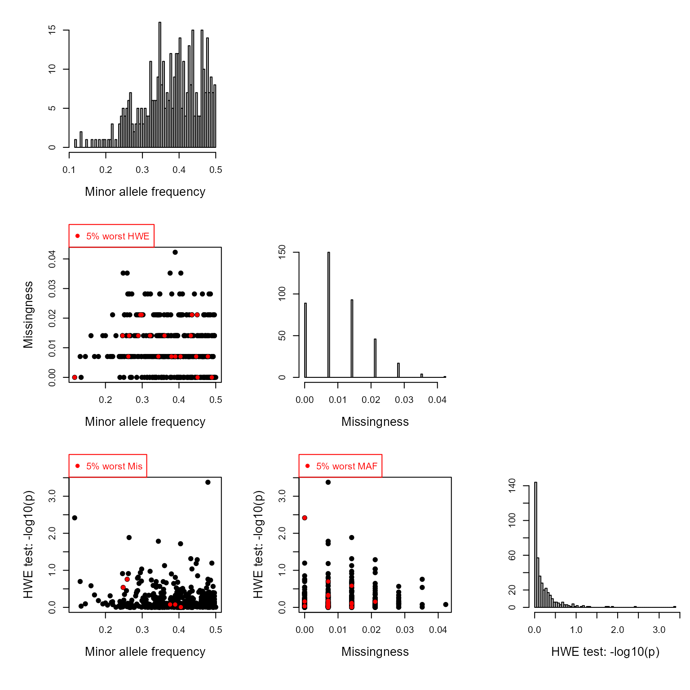
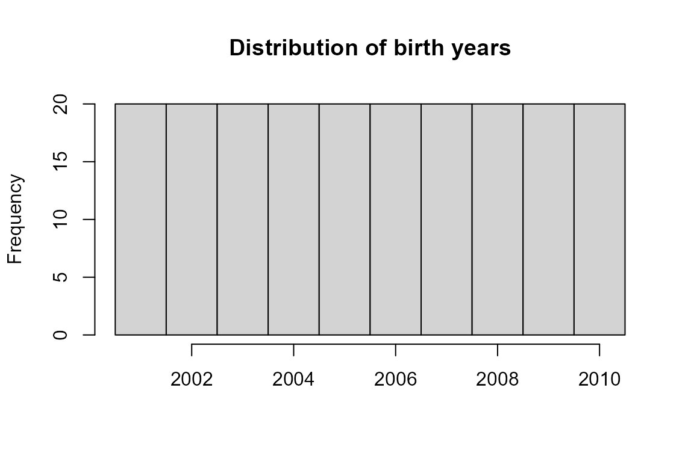
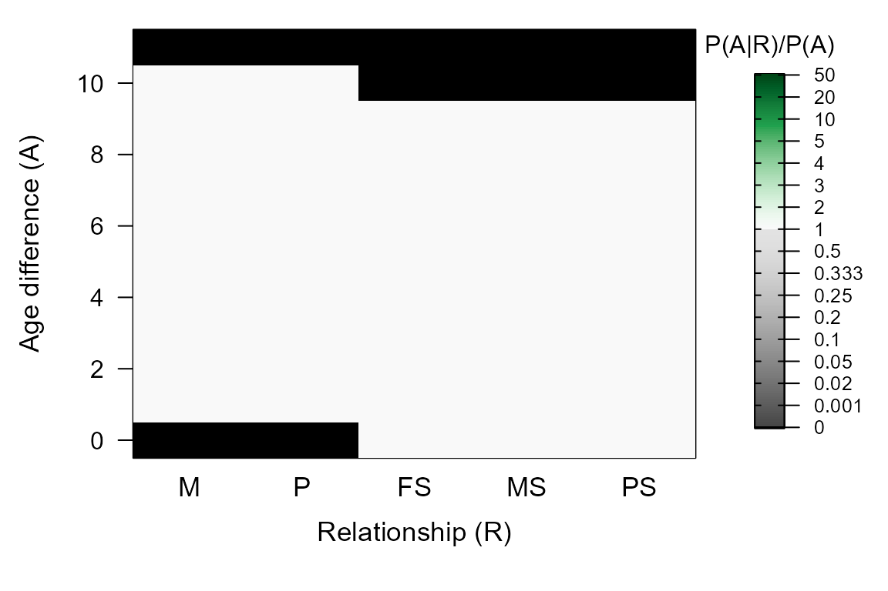
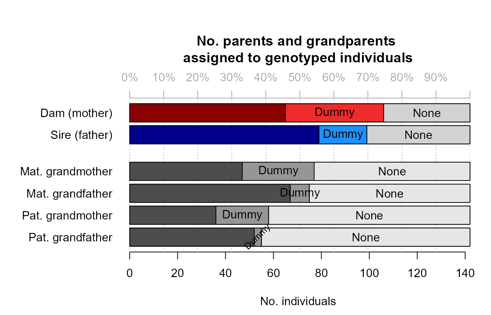
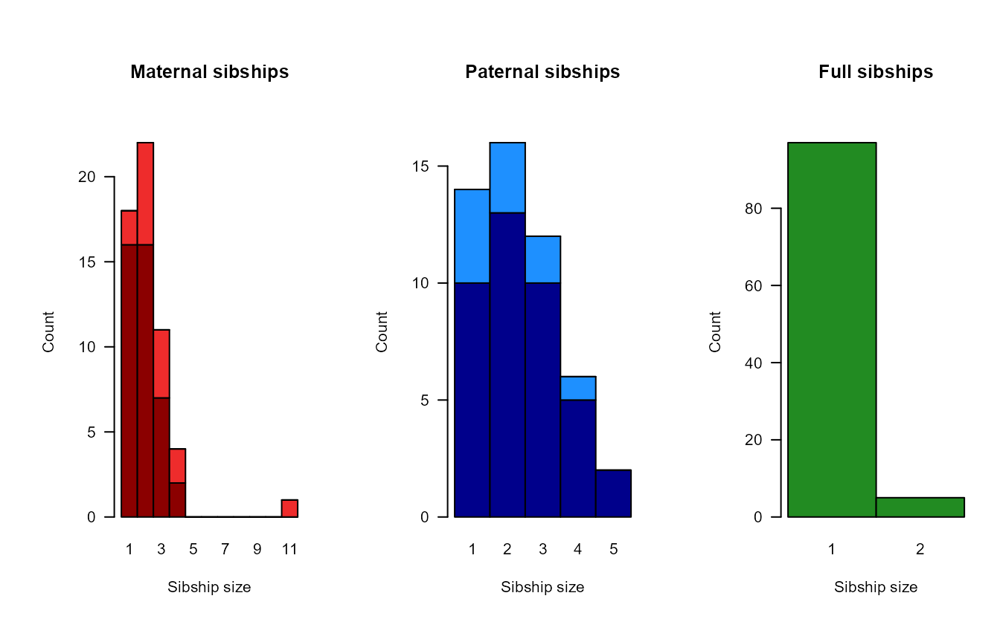
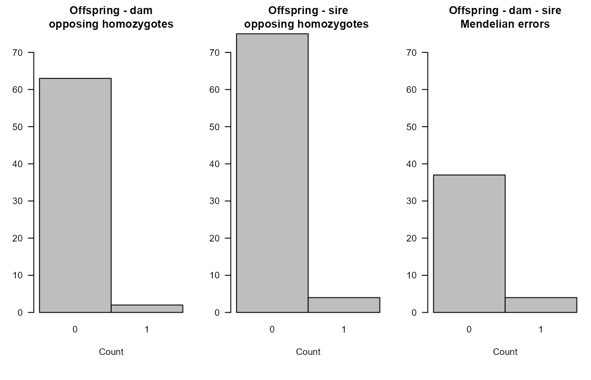
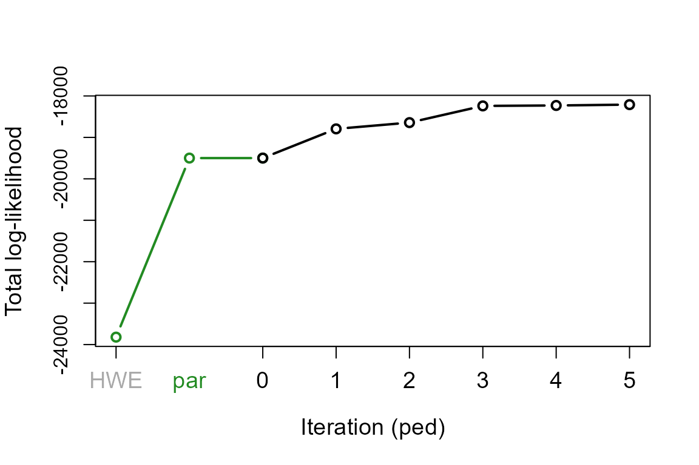

# Sequoia report

------------------------------------------------------------------------

*This report was created with the various griffin example files included
with the package. The markdown file can be found at
\[<https://github.com/JiscaH/sequoiaExtra>\] .*

------------------------------------------------------------------------

This pedigree was reconstructed using the R package `sequoia`.

The R package `sequoia` reconstructs the pedigree in two steps: first
genotyped parents are assigned to genotyped offspring (‘parentage
assignment’), followed by clustering of siblings sharing a non-genotyped
parent and assignment of grandparents (‘full pedigree reconstruction’).

------------------------------------------------------------------------

## Comments

This is a overview of the pedigree reconstruction for Griffins born
2001-2010.

------------------------------------------------------------------------

## Input summary

### Parameter settings

``` r
kable(as.data.frame(t(SeqOUT$Specs)), booktabs=TRUE) %>%
  kable_styling(full_width = FALSE)
```

|                      | Specs               |
|:---------------------|:--------------------|
| NumberIndivGenotyped | 142                 |
| NumberSnps           | 400                 |
| GenotypingErrorRate  | 1e-04               |
| MaxMismatchDUP       | 3                   |
| MaxMismatchOH        | 2                   |
| MaxMismatchME        | 2                   |
| Tfilter              | -2                  |
| Tassign              | 0.5                 |
| nAgeClasses          | 7                   |
| MaxSibshipSize       | 100                 |
| Module               | ped                 |
| DummyPrefixFemale    | F                   |
| DummyPrefixMale      | M                   |
| Complexity           | full                |
| Herm                 | no                  |
| UseAge               | yes                 |
| CalcLLR              | TRUE                |
| ErrFlavour           | version2.0          |
| SequoiaVersion       | 2.3.18              |
| TimeStart            | 2022-12-17 12:33:09 |
| TimeEnd              | 2022-12-17 12:33:33 |

Genotyping error: probability that actual genotype ‘act’ (rows) is
observed as genotype ‘obs’ (columns).

``` r
SeqOUT$ErrM
```

    ##    obs
    ## act         0          1         2
    ##   0 9.999e-01 9.9995e-05 2.500e-09
    ##   1 5.000e-05 9.9990e-01 5.000e-05
    ##   2 2.500e-09 9.9995e-05 9.999e-01

``` r
# Note: this error matrix can be fully customised, see ?ErrToM
```

### Genetic data

``` r
if (!all(GenoM %in% c('NA', NA))) {
  SnpStats(GenoM)
} else {
  cat('No genotype matrix provided for this report. \n')
}
```



``` r
# Note1: SNPs with missingness >=90% (scored for <10% of individuals) are 
#       automatically excluded.
# Note2: Higher MAF is better. Monomorphic SNPs are automatically excluded.
# Note3: Very strong departure from HWE may affect pedigree reconstruction. 
```

### Life history data

In sequoia, sex is coded as 1=female, 2=male, 3=unknown,
4=hermaphrodite.

``` r
table(Sex = SeqOUT$LifeHist$Sex)
```

    ## Sex
    ##   1   2 
    ##  95 105

Unknown birth years may hinder pedigree reconstruction. Among others,
they are used to determine which individual is the parent, and which the
offspring in genetically identified parent-offspring pairs.

``` r
LH <- SeqOUT$LifeHist

table('Birth Year' = factor(LH$BirthYear <0, levels = c(FALSE, TRUE), 
                            labels = c('known', 'missing')),
      'min/max Birth Year' = factor(LH$BY.min <0 & LH$BY.max <0, 
                                    levels = c(FALSE, TRUE), 
                                    labels = c('known', 'missing')))
```

    ##           min/max Birth Year
    ## Birth Year known missing
    ##    known       0     200
    ##    missing     0       0

``` r
hist(LH$BirthYear, 
     breaks = c(min(LH$BirthYear, na.rm=TRUE) : (max(LH$BirthYear, na.rm=TRUE)+1)) -.5,
     main = 'Distribution of birth years', xlab='')
```



### Age distribution prior

The ‘age prior’ specifies the minimum and maximum age of parents, and
the age difference distribution between siblings.

By default, for parentage assignment a flat prior is used with maximum
parental age equal to the largest age difference between genotyped
individuals. The maximum age for dams and sires can also be specified,
as can discrete versus overlapping generations. The distribution can
also be fully customised.

This age difference distribution is updated after parentage assignment
and before full pedigree reconstruction (see further).

``` r
if (!all(GenoM %in% c('NA', NA))) {
  LH_a <- LH[LH$ID %in% rownames(GenoM),]
} else {
  LH_a <- LH
}
AP_IN <- do.call(MakeAgePrior, c(list(Pedigree = NULL,
                                      LifeHistData = LH_a),
                                 SeqOUT$args.AP))
```

    ## ℹ Ageprior: Flat 0/1, overlapping generations, MaxAgeParent = 10,10



``` r
# Note: Details about and help on the age prior can be found in 
#       vignette("Sequoia - Age 'Prior'")
```

``` r
SeqOUT$args.AP
```

    ## $Flatten
    ## NULL
    ## 
    ## $Smooth
    ## [1] TRUE

------------------------------------------------------------------------

## Output summary

### Pedigree summary

Sibling clusters sharing a non-genotyped parent are assigned a ‘dummy’
parent. Via grandparent assignment to sibling clusters, parents are
assigned to these dummy individuals. These grandparents may be both
genotyped or dummy individuals.

Identifying the real non-genotyped individual corresponding to each
dummy individual may not always be possible, but the [`sequoia`
website](https://jiscah.github.io/articles/pedcompare_example.html)
offers some suggestions when candidates are known.

``` r
sumry <- SummarySeq(SeqOUT, Plot=FALSE)
PlotSeqSum(sumry, SeqOUT$Pedigree, Panels='all', ask=FALSE)
```



The distributions of the number of opposing homozygous loci and other
Mendelian errors in parent-offspring pairs and parent-parent-offspring
trios give a rough impression of the genotyping error rate. These would
always be zero in absence of any genotyping errors (and in absence of
pedigree errors).

The distributions of the log10 likelihood ratios give a rough impression
of the power of the genetic data to distinguish between different types
of relationships and resolve the pedigree. Note that this is the
likelihood ratio between the assigned parent being the parent versus it
being another type of close relative, such as a full sibling of the
focal individual or the true parent. It is *not* relative to other
candidate parents of the focal individual.

``` r
kable(sumry$PedSummary, booktabs=TRUE) %>%
  kable_styling(full_width = FALSE)
```

|                        | All | SNPd |
|:-----------------------|----:|-----:|
| records                | 167 |  142 |
| maternities            | 122 |   65 |
| paternities            | 116 |   79 |
| full sibs              |   5 |    5 |
| maternal half sib      | 129 |   89 |
| paternal half sibs     | 103 |   77 |
| maternal grandmothers  |  89 |   77 |
| maternal grandfathers  |  84 |   75 |
| paternal grandmothers  |  69 |   58 |
| paternal grandfathers  |  66 |   55 |
| maximum pedigree depth |   8 |    7 |
| founders               |  36 |   39 |

The size, depth and interconnectedness of the pedigree affect the power
with which the pedigree can be used in subsequent analyses, such as
heritability estimates.

### Age distribution

After assignment of genotyped parents to genotyped offspring, the
reconstructed pedigree is combined with the provided birth year
information to estimate the distribution of age differences among
mother-offspring, father-offspring, and sibling pairs. This age
distribution is then used during further pedigree reconstruction.

``` r
PlotAgePrior(SeqOUT$AgePriors)
```


#### Estimated birth years

When a birth year is unknown, it is estimated from combining the above
distribution of parental ages with any known birth years of its assigned
parents and offspring.

``` r
LH_new <- SeqOUT$LifeHistSib
LH_new[LH_new$BirthYear < 0, ]
```

    ## [1] id        Sex       BirthYear BY.min    BY.max    Sexx      BY.est   
    ## [8] BY.lo     BY.hi    
    ## <0 rows> (or 0-length row.names)

#### Inferred sex

When the sex of an individual is missing from the input, it may be
inferred during pedigree reconstruction when this individual forms a
complementary parent pair with an individual of known sex (in species
without hermaphrodites).

``` r
LH_new[LH_new$Sex == 3 & LH_new$Sexx != 3, ]
```

    ## [1] id        Sex       BirthYear BY.min    BY.max    Sexx      BY.est   
    ## [8] BY.lo     BY.hi    
    ## <0 rows> (or 0-length row.names)

### Non-assigned likely relatives

The `sequoia` algorithm is rather conservative when making assignments;
it sequentially ‘grows’ the pedigree, and tries to avoid a snowball
effect of assignment errors. So, when no parent or siblings are
assigned, this does not necessarily mean these are not present in the
dataset.

The R package includes a separate function to identify pairs of likely
relatives that have not been assigned, which may be due to a variety of
reasons.

``` r
if (!all(Maybe %in% c('NA', NA))) {
  MaybePO <- GetRelM(Pairs=Maybe$MaybePar)
  PlotRelPairs(MaybePO)
  if ('MaybeRel' %in% names(Maybe)) {
    MaybeM <- GetRelM(Pairs=Maybe$MaybeRel)
    PlotRelPairs(MaybeM)
  }
} else if (!all(GenoM %in% c('NA', NA))) {
  Maybe <- GetMaybeRel(GenoM, SeqList = SeqOUT, Module = 'ped', quiet=TRUE)
  MaybeM <- GetRelM(Pairs=Maybe$MaybeRel)
  PlotRelPairs(MaybeM)
} else {
  cat("No 'maybe relatives' provided for this report. \n")
}
```


### Confidence probabilities

The assignment accuracy is estimated from simulations. These simulations
make several simplifying assumptions, and these numbers are therefore a
lower bound for the confidence probability.

The probability is not estimated for each individual separately.
Instead, they are grouped across a few categories, based on whether the
parent is dam or sire, genotyped or a dummy, and whether there is a
co-parent or not. It is also separated for genotyped versus dummy focal
individuals.

``` r
if (!all(Conf %in% c('NA', NA))) {
  kable(Conf$ConfProb,
        caption = 'parent-pair confidence, per category (Genotyped/Dummy/None)')
} else {
  cat('No confidence probabilities provided for this report. \n')
}
```

|     | id.cat | dam.cat | sire.cat |  dam.conf | sire.conf | pair.conf |   N |
|:----|:-------|:--------|:---------|----------:|----------:|----------:|----:|
| 14  | G      | G       | G        | 1.0000000 | 1.0000000 | 1.0000000 | 568 |
| 13  | G      | G       | D        | 1.0000000 | 1.0000000 | 1.0000000 | 277 |
| 15  | G      | G       | X        | 1.0000000 |        NA |        NA | 227 |
| 11  | G      | D       | G        | 0.9841270 | 1.0000000 | 0.9841270 | 252 |
| 10  | G      | D       | D        | 1.0000000 | 1.0000000 | 1.0000000 |  88 |
| 12  | G      | D       | X        | 1.0000000 |        NA |        NA |  49 |
| 17  | G      | X       | G        |        NA | 1.0000000 |        NA | 197 |
| 16  | G      | X       | D        |        NA | 1.0000000 |        NA |  38 |
| 18  | G      | X       | X        |        NA |        NA |        NA | 804 |
| 5   | D      | G       | G        | 0.9914530 | 0.9914530 | 0.9914530 | 117 |
| 4   | D      | G       | D        | 1.0000000 | 1.0000000 | 1.0000000 |   9 |
| 6   | D      | G       | X        | 1.0000000 |        NA |        NA |  34 |
| 2   | D      | D       | G        | 0.8888889 | 1.0000000 | 0.8888889 |   9 |
| 1   | D      | D       | D        |       NaN |       NaN |       NaN |   0 |
| 3   | D      | D       | X        | 0.7777778 |        NA |        NA |   9 |
| 8   | D      | X       | G        |        NA | 0.9705882 |        NA |  34 |
| 7   | D      | X       | D        |        NA | 1.0000000 |        NA |   3 |
| 9   | D      | X       | X        |        NA |        NA |        NA | 100 |

parent-pair confidence, per category (Genotyped/Dummy/None)

------------------------------------------------------------------------

## Further details

### Likelihood curve

The total likelihood is the probability of observing the genetic data,
given the inferred pedigree and the presumed genotyping error rate. The
initial likelihood is the probability if all genotyped individuals were
unrelated and sampled from a large population in Hardy-Weinberg
Equilibrium. The likelihood increases during pedigree reconstruction,
and pedigree reconstruction is terminated when the total likelihood
asymptotes.

``` r
nIt <- c(par = length(SeqOUT$TotLikPar),
         ped = length(SeqOUT$TotLikSib))
with(SeqOUT, plot(1:nIt[1], TotLikPar, type="b", lwd=2, col="forestgreen",
                  xlim=c(1, sum(nIt)-1), xlab="Iteration (ped)", xaxt='n', cex.lab=1.2,
                  ylim=c(min(TotLikPar), max(TotLikSib)), ylab="Total log-likelihood"))
with(SeqOUT, lines((nIt[1]-1) + 1:nIt[2], TotLikSib, type="b", lwd=2))
axis(1, at=1, labels = 'HWE', cex.axis=1.2, col.axis='darkgrey')
axis(1, at=(nIt[1]+1)/2, labels = 'par', lwd.ticks=0, col.axis='forestgreen', 
     cex.axis=1.2)
axis(1, at=(nIt[1]):(nIt[1]+nIt[2]), labels=0:nIt[2], cex.axis=1.2)
```


