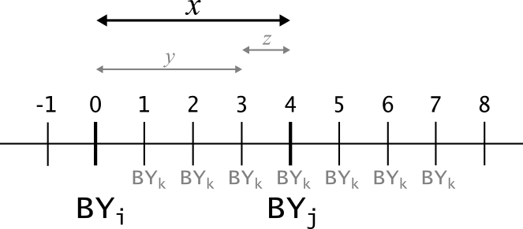

# Grandparents & Avuncular  {#sec:GP-AU}
 --------------------------


## Maths
The age difference between say a grand-offspring and its maternal full uncle, depends on the age difference between the individual and its mother, and between its mother and her full brother. It is assumed that these age differences are independent, so that the ageprior for maternal full-avuncular pairs can be calculated directly from the agepriors for mother-offspring and full sibling pairs. 

If individual $i$ is born in year $0$, then the probability that its maternal full uncle $j$ is born in year $x$
is proportional to the ageprior $\alpha_{A=x, R=MFA}$. This probability is calculated as the probability that $i$'s mother $k$ is born in year $y$, summed over all possible $y$ (see Figure \@ref(fig:timelineAU), with example $y=3$).

```{r timelineAU, echo=FALSE, fig.cap="Age difference between individual i and aunt/uncle j, and possible 'birth years' for i's parent k.", out.width="60%"} 

```

The probability that $k$ is born in year $y$ is a function of both the age difference between mother-offspring pair $i$ and $k$ ($A_{i,k}=y$, $y>0$) and between full siblings $k$ and $j$ ($A_{j,k} = x - y = z$). 

The probability that uncle $j$ is born in year $x$ can then be written as: 


\begin{align}
P(A_{i,j} = x | R_{i,j} = MFA) \propto &\sum_{y=0}^{Tmax} \sum_{z= -Tmax}^{Tmax} I(y + z = x) \cdot \\
&P(A_{i,k} = y | R_{i,k}=M) P(A_{k,j} = z | R_{k,j} = FS) 
\end{align}

where $I(y + z = x)$ is an indicator which equals $1$ if $y$ and $z$ sum to $x$, and equals $0$ otherwise. 

For avuncular pairs, both $z$ and $x$ may be negative; $z$ if uncle $j$ is a younger sibling of mother $k$ ($BY_j$ < $BY_k$), and $x$ if the age difference between the siblings is larger than between mother and offspring ($BY_j$ < $BY_i$). For grand-offspring -- grandparent pairs, both $A_{i,k}$ and $A_{k,j}$ are strictly positive. 


### Ageprior to Probability to Ageprior
To calculate the avuncular and grand-parental age difference probabilities, first the agepriors for the parental and sibling pairs are scaled so that or each relationship they sum to 1.   

After calculation, the grandparent and avuncular age-difference probabilities are scaled to be comparable with the parent-offspring and sibling agepriors. Scaling by the total number of pairs with that age difference (column 'X' in [`tblA.R`](#sec:tblAR)) is often problematic, because the large age differences possible for grand-parental pairs are often sparsely sampled, or not at all. A very small denominator results in an inflated ageprior, while a denominator of zero results in an undefined ageprior. Instead, the grandparent and avuncular age-difference probabilities are scaled by the mean of the (column) sums of the mother-offspring and father-offspring agepriors, which are typically quite similar to each other and to the column sums of the sibling agepriors. 


### change from v1.3 to v2.0
The ageprior distribution for avuncular pairs (aunts/uncles) has changed considerably from sequoia v1.3.3 to v2.0. Earlier, it was assumed that the ageprior for maternal and paternal full- and half- aunts and uncles was approximately similar, and approximately symmetrical around zero. From version 2.0 both these assumptions have been dropped, and there are now 6 avuncular classes (FS, MS, or PS of dam or sire) with agepriors that are not symmetrical around zero.

The agepriors for grandparents and avuncular relationships have always been estimated from parent and sibling age distributions, but this estimation has now been moved from `MakeAgePrior()` in R (up to v.1.3.3) to the Fortran part of `sequoia()`. The extra columns are calculated just *before* parentage assignment or sibship clustering, and returned in the output as `AgePriorExtra`. This is in contrast to the 'regular' ageprior, which is updated just after parentage assignment (see also pipeline in Figure \@ref(fig:pipeline)). 


