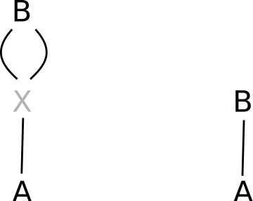

# Hermaphrodites
 --------------

Hermaphrodites have been re-implemented in versions 2.2 and 2.3, and now also full pedigree reconstruction should work as expected. Selfing is fully supported, also when a selfing parent or its selfed offspring are non-genotyped, and the aim is to infer their genotyped relatives. 

With hermaphrodites it is not self-evident whether an identified parent should be assigned as dam or as sire. Sex-linked markers are not implemented in `sequoia`, and sequential hermaphroditism (male until age $t$, and female after, or *v.v.*) is not the norm. 

Two alternative approaches are available, by specifying parameter `Herm='A'` or `Herm='B'`. 


## Herm 'A': Pedigree prior
A genetically identified parent will be assigned when it matches a candidate parent, or when it forms a complementary parent-pair with such an assigned parent. The candidate dam may e.g. be the plant from which the seed was collected. Candidate parent--offspring pairs that are not a genetic match will never be assigned, non-genotyped candidate parents are ignored. 

In absence of a pedigree prior, only instances of selfing will be assigned. 

The pedigree 'prior' can only be used during parentage assignment, by specifying `SeqList[["PedigreePar"]]` as input *and* setting `Module='par'` (`MaxSibIter=0`):
```{r }
cand.dams <- read.table("Candidate_dams.txt", header=TRUE,
                        stringsAsFactors=FALSE)
# cand.dam has columns 'id' and 'dam', and does not need entries for all ids
cand.par <- cbind(cand.dams, sire=NA)

par.herm <- sequoia(GenoM = Geno,
                    LifeHistData = LH,
                    SeqList = list(PedigreePar = cand.par),
                    Module='par')

# re-use all settings (including the newly assigned parents):
seq.herm <- sequoia(GenoM = Geno,
                    LifeHistData = LH,
                    SeqList = par.herm,
                    Module='ped')
```


## Herm 'B': Ignore sex role
Often it is irrelevant whether the parent was the maternal or paternal parent, and with this setting single parents are assigned as dams, and in parent-pairs dam vs sire is determined by their order in the genotype file. 


## Hermaphrodite dummies
Whether half-siblings share a dummy dam or a dummy sire is arbitrary. If one or more individuals in a sibship are the product of selfing, the maternal and paternal halves will be linked, and additional half-siblings will be arbitrarily assigned to either half. Dummy individuals which occur as both dam and sire get dummy prefix `'H'`, an alternative 3rd `DummyPrefix` can be specified in (most?) relevant functions.

In `SeqList[["DummyIDs"]]`, the offspring-as-dam and offspring-as-sire are shown separately, with the same id ('H0xxx') and Sex=1 vs Sex=2 respectively. Selfed offspring will occur in both rows. Estimated birth years and other aspects may differ somewhat between the maternal and paternal halves, as during pedigree reconstruction they are (currently?) only linked in some aspects but not others. 


## Assignment errors
`PedCompare()` is not useful in combination with `Herm='B'`, as any dam assigned as sire and v.v. will show up as error. Use instead `ComparePairs(, patmat=FALSE)`, which will also pick up half-siblings for which the mother of $i$ is the father of $j$. 

One type of assignment error is unavoidable: if the true parent is unsampled and the product of selfing, a sampled grandparent will be indistinguishable from a parent. Similarly, when the true parent is sampled, but both the parent and the grandparent are the product of selfing, they are genetically nearly identical and often erroneously interchanged when birth year information is absent. 


```{r parent-selfed, echo=FALSE, eval=TRUE, fig.cap="Two configurations with identical likelihoods", out.width="20%", fig.pos="!h", fig.align="center"} 

```
