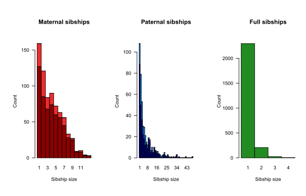

# Output check
 -------------


## Pedigree stats \& plots
Various summary statistics can be calculated and displayed using `SummarySeq()`, such as the number and kind of assigned parents (Figure \@ref(fig:SumSeq-parents)), family sizes (Figure \@ref(fig:SumSeq-sibsize)), and the distributions of Mendelian errors. Its output also includes a table analogous to `pedigreeStats` by R package `pedantics` (which was archived on CRAN in December 2019).


```{r SumSeq-parents, echo=FALSE, eval=TRUE, fig.cap="Number of parents assigned to genotyped individuals, split by category", out.width="80%"}
knitr::include_graphics("figs/SummarySeq_deer.png")
```


```{r SumSeq-sibsize, echo=FALSE, eval=TRUE, fig.cap="Family sizes, split by genotyped (dark) or dummy (light) parent", out.width="80%"}

```
 

There is a range of software available to plot pedigrees in various styles, such as R package `kinship2` or the program PedigreeViewer. Be aware that many use a different column order (id - sire - dam, rather than id - dam - sire), use $0$ to denote missing parents rather than NA, and/or do not allow individuals to have a single parent (they must have 0 or 2 parents). The last two issues can be resolved with `Sequoia`'s function `PedPolish()`.

<!-- \clearpage  --> 


### Negative LLR's 
The parent LLR's are calculated based on genetic data only, without any consideration of age. Consequently, they are often close to zero for dummy -- dummy parent-offspring pairs, as genetically the parent may just as well be the offspring. Such pairs will not have been assigned unless there is a compatible co-parent (`LLRpair` should always be positive) or if there is overwhelming age-based evidence to decide which one is the parent.

When a parental LLR is negative without an accompanying co-parent, or when `LLRpair` is negative, this is reason to cautious about the assignment and for example [compare it to a previous pedigree](#sec:compPed) or inspect the [genomic relatedness](#sec:compR). In contrast to MCMC type approaches, `sequoia`'s algorithm has limited scope to undo previously made assignments, and may get stuck at suboptimal solutions.

Extremely negative LLRs ($< -100$) are typically caused by one or more of the alternative relationships considered, now conditional on the rest of the pedigree, being very convoluted and neither being caught as 'highly improbable and not implemented' nor being implemented properly (see Table [weird relationships](#sec:WeirdRels) for double relationships that are implemented). In the unlikely event that the parent-offspring relationship itself is not implemented properly you will see an error value of 444 or 777.


### Dyad plot
Per popular request, from version 2.1 sequoia includes `PlotRelPairs()` to produce pairwise plots, similar to Colony's plot of half- and full-sibling dyads. It plots the output from `GetRelM()`, where you can specify if you want to trace each individual's pedigree 1 generation back (as in Figure \@ref(fig:Relplot)) or 2 (include grandparents & aunts/uncles), and whether or not you want to differentiate between paternal and maternal relatives. It includes some basic functionality to subset individuals. 

```{r Relplot, echo=FALSE, eval=TRUE, fig.cap="Example plot from PlotRelPairs()", out.width="100%"}
# Rel.griffin <- GetRelM(PedPolish(Ped_griffin[Ped_griffin$birthyear <2004, ]), 
#                        patmat=TRUE, GenBack=1)
# PlotRelPairs(Rel.griffin)   # poor figure quality

```


## Compare pedigrees {#sec:compPed}
Often a (part) pedigree is already available to which one wants to compare the newly inferred pedigree, for example to field-observed mothers or a microsatellite-based pedigree. `PedCompare()` compares for each individual the assigned parents between the two pedigrees (match/mismatch), while `ComparePairs()` compares for each pair their relationship between the two pedigrees (e.g. full sibs vs half sibs). Both pedigrees may have genotyped as well as non-genotyped individuals. 

Most of the terminology in this vignette and the helpfiles is based on `Ped1` being the 'true' pedigree (the one from which data is simulated) and `Ped2` is the inferred pedigree (from the simulated data), but both functions work for any two pedigrees. From version 2.0 onwards you can indicate in `PedCompare()` that both pedigrees may be imperfect (`Symmetrical = TRUE`). 


### Dummy matching
Comparing two pedigrees becomes complicated when dummy IDs are involved -- When are non-identical parental IDs between the two pedigrees actually referring to the same individual? For example, in Table \@ref(tab:PedComp-ex1) the mother of Blossom and Bob is Beta in Pedigree1, and dummy female F0007 in Pedigree 2. It seems fair to assume that F0007 thus refers to the non-genotyped female Beta. And since Alpha was assigned as maternal grandmother to Blossom and Bob, we can also conclude that Alpha must be the mother of Beta! 

```{r PedComp-ex1, echo=FALSE, eval=TRUE}
Ped1 <- data.frame(id = c("Alpha", "Beta", "Abigail", "Aster", "Blossom", "Bob", "-"),
                    dam = c("","", "Alpha", "Alpha", "Beta", "Beta", ""),
                    sire = c("","", "Zorro", "Yann", "", "Zorro", ""))
Ped2 <- data.frame(id = c("Alpha", "-", "Abigail", "Aster", "Blossom", "Bob", "F0007"),
                   dam = c("", "", "Alpha", "Alpha", "F0007", "F0007", "Alpha"),
                   sire = c("", "", "Zorro", "M0004", "", "Zorro", ""))
knitr::kable(list(Ped1, Ped2), 
             caption = "Example comparison between Pedigree1 (left) and Pedigree2 (right)", booktabs=TRUE)
```


Matching and replacing dummy IDs this way extends the number of individuals with both pedigree and phenotypic data, which will among others increase power of any downstream quantitative genetic analyses. 

More specifically, `PedCompare()` considers it a 'match' if the inferred sibship (in Pedigree2) which contains the most offspring of a non-genotyped parent (in Pedigree1), consists for more than half of this individual's offspring. If for example a cluster of $5$ siblings in Pedigree1 is split into two clusters in Pedigree2, the larger sibship (of say 3 individuals) is considered a match, and the smaller a mismatch (thus 2 mismatches) --- even though it could be argued the inferred Pedigree2 does not contain any incorrect links. For this same example, `ComparePairs()` would tell that the $(5*4)/2=10$ halfsib pairs in Pedigree1 are $3+1$ halfsib pairs in Pedigree2, and $6$ unrelated pairs. `ComparePairs()` does not attempt any matching of dummy individuals. 


### Example

```{r RunPedComp}
# load data.
data(SeqOUT_griffin, FieldMums_griffin, package="sequoia")

PCG  <- PedCompare(Ped1 = cbind(FieldMums_griffin,
                                sire = NA),
                   Ped2 = SeqOUT_griffin$Pedigree,
                   SNPd = SeqOUT_griffin$PedigreePar$id,
                   Symmetrical = TRUE)

# pedigrees side-by-side (subset of columns because no field-observed sires here)
PCG$MergedPed[127:133, c("id", "dam.1", "dam.2", "dam.r", "id.dam.cat", "dam.class")]
#  Non-genotyped field mums have a two-colour code (e.g. 'BlueRed')

PCG$MergedPed[c(137,138, 6, 128,129,7), c("id", "id.r", "dam.1", "dam.2", "dam.r")]
# column 'id': ids common to both pedigrees, plus those only in Pedigree2 
# column 'id.r': 'consensus' ids, plus those only occurring in Pedigree1  

# dummy individuals from Ped2 with their best-matching non-genotyped individual in Ped1
head(PCG$DummyMatch[, -c(3:5)])
# 'nomatch' in the `id.1` column: none of the siblings in Ped2 had a field-observed
# mother, or there is a mismatch.

# Total number of matches & mismatches:
PCG$Counts
# dim1: category: genotyped/dummy/total
# dim2: classification: total (could-have-had-parent)/ match/ mismatch/ 
#       P1only (no parent in Ped2)/ P2only
# dim3: dam/sire
```

See [here](./../../pedcompare_example.html) for a detailed walk-through of this example, and suggestions on how to trace the underlying cause of discrepancies between the newly-inferred genetic pedigree and an existing field pedigree. 

In short, the main aim of checking the discrepancies is to figure out the underlying cause of each case:   

* pedigree reconstruction error,
* wet lab error (sample swap/mislabeling), or
* field 'error' (e.g. mistaken/unknown identity),

so that the records and/or pedigree can be corrected. `PedCompare()` only points you to where the discrepancies are; field records, lab records and common sense are needed to determine the most likely cause (or determine that the cause is unknowable). 

Fairly common (but still rare) pedigree reconstruction errors are  

* one sibship is erroneously split into two,
* two sibships are erroneously merged into one,
* an aunt/uncle is assigned as sibship-grandparent,
* the parent-offspring relationship between to dummy individuals, or between two genotyped individuals with unknown birth years, is flipped the wrong way around.  


```{r checks}
# ~~ Mismatches ~~
PCG$MergedPed[which(PCG$MergedPed$dam.class == "Mismatch"), 
               c("id", "dam.1", "dam.2", "id.dam.cat")]

PedM <- PCG$MergedPed[, c("id", "dam.1", "dam.2")]   # short-hand to minimise typing

# who are the mismatching individual's siblings according to Ped1 & Ped2? 
PedM[which(PedM$dam.1 == "GreenBlue"), ]
PedM[which(PedM$dam.2 == "i081_2005_F"), ]

# who are their maternal grandparents?
PedM[which(PedM$id.1 == "GreenBlue"), ]
PedM[which(PedM$id.2 == "i081_2005_F"), ]
```


### Colony
To compare Colony output with an existing pedigree, use: 
```{r }
BestConfig <- read.table("Colony/file/file.BestConfig",
                         header=T, sep="", comment.char="")
PC <- PedCompare(Ped1 = ExistingPedigree,
                 Ped2 = BestConfig)
```


## Relatedness {#sec:compR}

### Pedigree relatedness  {#sec:Rped}
Another way to compare two pedigrees is to compare the pedigree-based relatednesses calculated from each. In R, pedigree relatedness can for example be calculated by the R package `kinship2` -- relatedness is defined as twice the kinship coefficient.

`kinship2` requires a pedigree with columns id - dadid - momid - sex, and requires that individuals either have two parents, or zero. The latter can be achieved with `sequoia::PedPolish(, FillParents=TRUE)`. From `sequoia` version 2.1, `CalcRPed()` will reformat the pedigree, call `kinship2::kinship()`, and return relatedness coefficients as a matrix or dataframe. 

The same can be done for a second pedigree, and the two dataframes merged. As the number of pairs $p$ becomes very large even for moderate numbers of individuals $n$ ($p$ = $n \times (n-1)/2$, so e.g. 2 million pairs for 2 thousand individuals), it is a good idea to use package `data.table` to assist with merging (merge in seconds vs. many minutes or not at all):

```{r, eval=FALSE}
Rped.old <- CalcRped(Ped_griffin, OUT="DF")
Rped.new <- CalcRped(SeqOUT_griffin$Pedigree, OUT="DF")
library(data.table)
Rped.both <- merge(data.table(Rped.old, key=c("IID1", "IID2")),
                   data.table(Rped.new, key=c("IID1", "IID2")), 
                   all=TRUE, suffixes=c(".old", ".new"))

cor(Rped.both$R.ped.new, Rped.both$R.ped.old, use="pairwise.complete")
plot(Rped.both$R.ped.old, Rped.both$R.ped.new, pch=16, cex=0.3)
```

```{r Rped-plot, eval=TRUE, fig.cap="", fig.cap="", fig.width=4, out.width="60%"}
knitr::include_graphics("figs/Rped_scatter.png")
```


### Genomic relatedness
In absence of a previous pedigree, or when it is not obvious whether the previous or newly inferred pedigree is correct, one could compare the pairwise relatedness estimated from the pedigree(s) to a measure of genomic relatedness, estimated directly from the complete SNP data -- which may be many more SNPs than used for pedigree reconstruction. Genomic relatedness can be estimated for example using [GCTA](http://cnsgenomics.com/software/gcta/#MakingaGRM). Genomic relatedness will vary around the pedigree-based relatedness even for a perfect pedigree due to Mendelian variance, but outliers suggest pedigree errors.

For example: 
```{r }
# read in output from GCTA
Rel.snp <- read.table("GT.grm.gz")   
Rel.id <- read.table("GT.grm.id", stringsAsFactors=FALSE)
Rel.snp[,1] <- as.character(factor(Rel.snp[,1], labels=Rel.id[,2]))
Rel.snp[,2] <- as.character(factor(Rel.snp[,2], labels=Rel.id[,2]))
names(Rel.snp) <- c("IID1", "IID2", "nSNPS", "R.GRM")
Rel.snp <- Rel.snp[Rel.snp$IID1 != Rel.snp$IID2,]  # between-indiv only
#
# combine with pedigree relatedness
Rel.both <- merge(data.table(Rel.snp[,c(1,2,4)], key=c("IID1", "IID2")),
                  data.table(Rped.both, key=c("IID1", "IID2")), all.x=TRUE)
Rel.both <- as.data.frame(Rel.both)  # turn back into regular dataframe
rm(Rel.snp, Rped.both, Rped.new, Rped.old)   # clean up: remove large dataframes
#
round(cor(Rel.both[, c("R.GRM","R.ped.new", "R.ped.old")], 
          use="pairwise.complete"), 3)
#
# scatterplot doesn't work well with many thousand points
# >> use heatmap-like alternative, e.g. hexbinplot
hexbin::hexbinplot(Rel.both$R.GRM ~ Rel.both$R.ped.new, 
                   xbins=100, aspect=1,
                   xlim=c(-.05,.9), ylim=c(-.2, .9),
                   xlab="Pedigree relatedness", ylab="Genomic relatedness",
                   trans=log10, inv=function(x) 10^x, 
                   colorcut=seq(0,1,length=14), maxcnt=10^6.5,
                   colramp = function(n) {grDevices::hcl.colors(n, palette='Berlin')})
#
# if you want to add e.g. a diagonal line to that plot:
hb <- hexbin::hexbin(Rel.both$R.GRM ~ Rel.both$R.ped.new, 
                     xbins=100, xbnds=c(-.05, .9), ybnds=c(-.2, .9),
             xlab="Pedigree relatedness", ylab="Genomic relatedness")
hbp <- hexbin::plot(hb,
                    trans=log10, inv=function(x) 10^x,
                    colorcut=seq(0,1,length=14), maxcnt=10^6.5,
                    colramp = function(n) {grDevices::hcl.colors(n, palette='Berlin')}
)
hexbin::hexVP.abline(hbp$plot.vp, a=0, b=1)
```


```{r eval=TRUE, fig.cap="Relatedness hexbinplot example", out.width="80%", position="!h"}
knitr::include_graphics("figs/hexbin.png")
```

## Cluster families
Certain analyses, such as the Mendelian error check in PLINK, are done on a family-by-family basis. `FindFamilies()` takes a pedigree as input and clusters the individuals in as few families as possible, by repeatedly searching all ancestors and all descendants of each individual and ensuring those all have the same family ID.

This function does not take separate FID and IID columns in the input pedigree, rather these need to be joined together before running `FindFamilies()` (e.g. with `paste()`), and then split afterwards using `PedStripFID()`.


