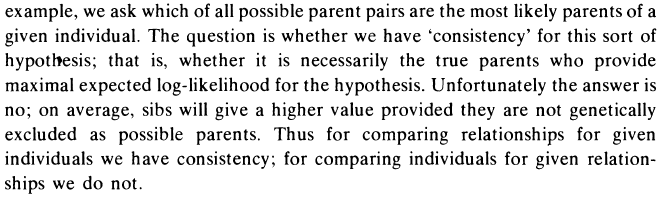

# Sequoia 

#### Multi-generational pedigree reconstruction from Single Nucleotide Polymorphism (SNP) data. Accounting for genotyping errors. Overlapping or discrete generations, with or without inbreeding, any proportion of genotyped parents. No lists of candidate parents needed, just birth years.

  

## What it can do

####  Parentage assignment

Candidate parent–offspring pairs are short-listed among all genotyped
individuals based on the number of SNPs at which they are opposing
homozygotes. Parents are assigned based on the likelihood ratio between
the pair being parent–offspring versus the most-likely alternative
relationship. The pair can be oriented if their relative age is known,
or if there is a complementary co-parent.  

####  Sibship clustering

When not all parents were genotyped, clusters of half- and full-siblings
are identified, and each assigned a dummy parent. Every dummy individual
corresponds to a real-world, non-genotyped individual.  

####  Grandparent assignment

For each cluster of half-siblings, grandparents are assigned where
possible, i.e. parents of the sibship’s dummy-parent. These grandparents
may be dummy individuals themselves, so that parent-offspring links may
be established between two non-genotyped individuals.

  
  

## Package overview

Beside the main function for pedigree reconstruction
([`sequoia()`](https://jiscah.github.io/reference/sequoia.md)) the R
package contains various other functions, amongst others to check
agreement between an existing pedigree and the genotype data, or with a
newly inferred pedigree.

  
  

  
  

For detailed information, please see the vignettes (rendered using
[bookdown](https://bookdown.org/yihui/bookdown/)):

  
  

## Rationale

Pedigree reconstruction with
[`sequoia()`](https://jiscah.github.io/reference/sequoia.md) relies on
the likelihood ratios between a focal relationship
(e.g. parent-offspring, PO) and a myriad of alternative relationships
for that pair (full siblings, aunt-niece, …, or unrelated U). This
method is inspired by the work of E.A. Thompson, such as this excerpt
from her paper *‘A Paradox of Genealogical Inference’* (1976):

In other words, when comparing likelihood ratios LLR(PO/U) *between*
candidate parents, by chance some full siblings may have a higher value
than the true parent, even in absence of genotyping errors.

One possible solution is to consider the likelihood of all assignments
jointly in an MCMC(-like) approach, but the number of possible pedigree
configurations to explore is enormous.

Comparing for each pair of putative relatives many different
relationships makes each assignment rather computationally intensive,
but this is offset by various filtering steps (based on e.g. the age
difference and Mendelian inconsistencies) and using a ‘hill-climbing
algorithm’ rather than an MCMC. Imagine it as taking slow, careful steps
up the mountain, carefully inspecting the direct surroundings before
taking a new step, compared to running around the mountainside more or
less at random. If there is a fairly clear path to the likelihood top
(i.e. moderately high quality SNP data), `sequoia` will usually do fine.
If there is not, an MCMC-based approach may be preferable.
