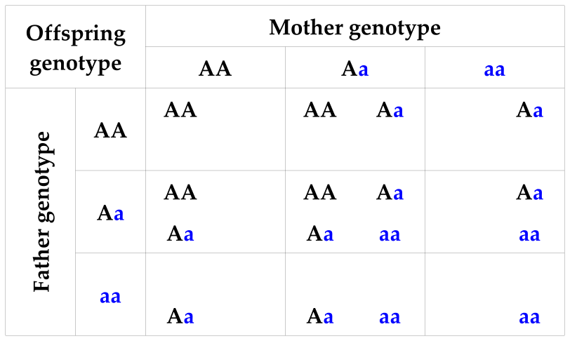
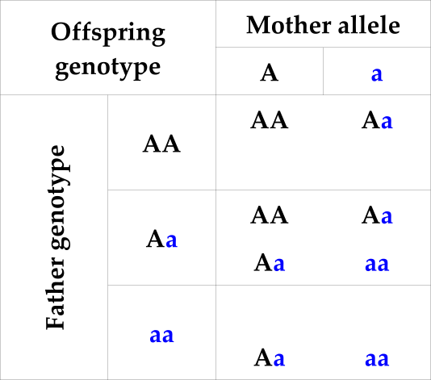
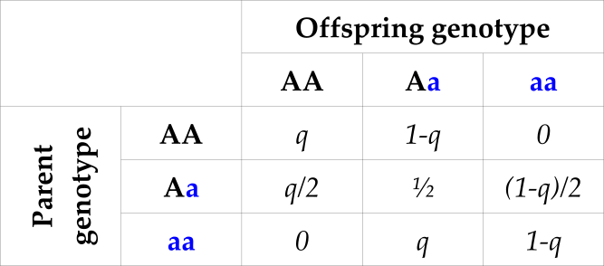

```{r setup, include=FALSE}
knitr::opts_chunk$set(echo = TRUE, fig.height=4, fig.width=6)
table_nums <- captioner::captioner(prefix = "Table")
library(sequoia)
```

 ---------------


## General

Genetic pedigree reconstruction relies critically on the pattern of Mendelian inheritance: the probability that an offspring inherits a specific genotype at a locus, given the genotypes of its parents. For a locus with two alleles (only biallelic SNPs are allowed in `sequoia`), the inheritance probabilities take the values of $0$, $1/4$, $1/2$, or $1$. 

They can be depicted in many different ways, which is mostly a matter of personal preference, but I tend to think of them as this kind of table:

`r table_nums(name="twoparents", caption="Possible offspring genotypes conditional on two parental genotypes")`

```{r twoparents, echo=FALSE, out.width="70%"}
 
```


which shows the possible offspring genotypes that may result from each possible combination of parental genotypes. For example, if the mother is **Aa** and father **AA**, there is a 50% chance the offspring is **AA**, and a 50% chance the offspring is **Aa**. 

In this table the allele inherited from the mother and the one inherited from the father are considered interchangeable, so that **Aa** = **aA**.

Note also that these are the *true* genotypes, which may differ from the *observed* genotypes due to genotyping errors. [^a]

[^a]: mutations can also cause deviations from this expected pattern, but are for pedigree reconstruction usually grouped together with genotyping errors; over the time spans of a typical pedigree they will be very rare. 


### Single parent
A similar table can also be constructed conditional on one instead of two parental genotypes. The other allele is then assumed to be drawn from the population allele pool at random, which contains the **A** allele at frequency $q$ and the **a** allele at frequency $1-q$. This is equivalent to the assumption that the genotype of the other parent is a random draw from the genotypes in the population under Hardy-Weinberg equilibrium (genotype frequencies of $q^2$, $2q(1-q)$ and $(1-q)^2$ for **AA**, **Aa** and **aa**, respectively). 

`r table_nums(name="oneparent", caption="Possible offspring genotypes conditional on one parental genotype and the allele inherited from the other parent")`

```{r, echo=FALSE, out.width="40%"}
 
```


`r table_nums(name="oneparprob", caption="Probability of offspring genotype (columns) conditional on one parental genotype and population allele frequency q for the 'A' allele")`

```{r, echo=FALSE, out.width="60%"}
 
```


## Parentage assignment based on Mendelian incompatibilities

### No genotyping errors
For an individual with **AA** at a locus, the true parent will not be **aa** at that locus (bottom-left in `r table_nums("oneparprob", display="cite")`), and thus all **aa** individuals can be discarded as potential parents. If for example the **A** allele has a frequency of $q=0.4$, this will discard about 36% of individuals ($(1-0.4)^2=0.36$), from just considering a single SNP. 

With an increasing number of SNPs considered, an increasing proportion of the population can be discarded as potential parent based on this opposing homozygosity test alone. 


### With genotyping errors
In real data, there is a small chance that an individual that was scored as **AA** truly has a parent that was scored as **aa**, as either one might be mis-genotyped and actually be heterozygous [^b] (see also the background info on [genotyping errors](genotyping_errors.html). To allow for this possibility, a non-zero maximum threshold is set for the number of loci at which an individual and candidate parent may be opposing homozygotes (OH), and the number of loci at which individual and candidate parent-pair may have Mendelian errors. The latter includes besides OH also cases were the offspring is heterozygous **Aa** and both parents are identical homozygotes (both **AA** or both **aa**; see `r table_nums("twoparents", display="cite")`). 


[^b]: the chance that both are mistyped, or that they are actually identical homozygotes, is usually much much smaller but rarely zero.   


If genotyping error is low and the number of SNPs is large (high hundreds/thousands), counting Mendelian errors is usually sufficient to reduce the number of candidate parents to a single pair or individual. It is widely used as a reliable method of parentage assignment, since with an abundance of high-quality SNP data the distinction between parent and not-parent is typically very clear (@hayes11, @calus11, @strucken15). 

### Limitations
Even with high quality data, close relatives other than the true parents will also be opposing homozygotes at a very low number of SNPs. This is especially true for full siblings of the focal individual and full siblings of the true parent.  In some settings it is straight forward to exclude full siblings as potential parents (e.g. in animal husbandry or with discrete generations), but full aunts and uncles can rarely be excluded *a priori*. 

Moreover, many datasets have too few SNPs and/or a too high genotyping error rate for this method to work reliably -- see the [example](#sec:Example)


## Expected number of Mendelian errors

The theoretical distribution of the number of Mendelian errors for true parent-offspring pairs and true parent-parent-offspring trios can be calculated from the number of SNPs, their genotyping error rate, and the allele frequencies. This is implemented in the R package as function `CalcMaxMismatch()`.

For parent-offspring pairs the calculations and R code are worked out here in detail, the calculations for parent-parent-offspring trios are similar. 

### Mismatch probability 
The probability that an offspring is observed as **aa** and its parent as **AA**, if the other parent is unknown, is a function of:

1. the probability that the parent's true genotype is $g_{par}$, given the population allele frequency $q$ and assuming Hardy-Weinberg equilibrium;
2. the probability that the parent is observed as **AA** if its true genotype is $g_{par}$; this depends on the genotyping error rate $E$ and [error structure](genotyping_errors.html);
3. the probability that the offspring inherits true genotype $g_O$, given its parents true genotype $g_{par}$ and the other parent's genotype is random;
4. the probability that the offspring is observed as **aa** if its true genotype is $g_{off}$;

Each of these probabilities is fairly straight forward, as is multiplying them and summing across all $3\times3$ possible true genotypes for the parent and the offspring. For example, for the case where $g_{par}=Aa$ and $g_{off}=aa$:

1. $P(g_{par}=Aa) = 2q(1-q)$
2. $P(obs\ AA | act\ Aa) = E/2$  (for the default error matrix)

3. $P_{inherit} =  (1-q)/2$  (`r table_nums("oneparprob", display="cite")`)
4. $P(obs\ aa | act\ aa) = (1-E/2)^2$

We could write out and simplify the expression summing over all nine genotype combinations, or we could let R do the hard work:

```{r}
# example values
q <- 0.4   # allele frequency
E <- 0.01  # genotyping error rate

# 1. probabilities of actual genotypes under HWE (0, 1 or 2 copies of reference allele)
AHWE <- c((1-q)^2, 2*q*(1-q), q^2)

# 2 + 4. probability of observed genotype (columns) conditional on actual genotype (rows) 
ErrM <- ErrToM(Err = E, flavour="version2.0", Return="matrix")
ErrM

# 3. probability that offspring actual genotype is 0/1/2 (rows) given 
#    parent actual genotype is 0/1/2 (columns). 
# (Transposed relative to Table 3)
AKAP <- matrix(c(1-q, (1-q)/2, 0,
                 q,   1/2,     1-q,
                 0,   q/2,     q), 
                 nrow=3, byrow=TRUE)
                 
# joined probability actual genotypes: (1. x 3.)
P.AA <- sweep(AKAP, 2, AHWE, "*")
dimnames(P.AA) <- list(0:2, 0:2)
P.AA

# joined probability observed genotypes: (2. x (1. x 3.) x 4.)
P.OO <- t(ErrM) %*% P.AA %*% ErrM
dimnames(P.OO) <- list(0:2, 0:2)
round(P.OO, 4)

P.Mismatch <- P.OO[1,3] + P.OO[3,1]
P.Mismatch
```

This is the probability that a single parent-offspring pair at this single locus are opposing homozygotes (OH). 

The expected number of loci at which a parent-offspring pair are OH follows a binomial distribution. For simplicity we assume in this example that all SNPs have the same allele frequency and same genotyping error rate (this assumption is not made by `CalcMaxMismatch()`.

```{r }
# using same no. SNPs as in low quality example data below
nSnp <- 100   

curve(dbinom(x, size = nSnp, prob = P.Mismatch),
      from=0, to=10, n=11, type="b",
      xlab="No. opposing homozygous loci", ylab="Probability")

cbind(OHcount = 0:5,
      prob = round(dbinom(0:5, size = nSnp, prob = P.Mismatch),4))
```


### Threshold
During parentage assignment, a threshold OH count is used to filter candidate parents. This threshold is set such that is highly unlikely that any true parent-offspring pairs are discarded. Assignments are made based on likelihoods calculated after the filtering step, and thus any not-parents that pass the filter will not necessarily result in false positive assignments [^c]. 

[^c]: but letting lots of pairs through the filtering step will increase computational time. 

The threshold must be such that the expected OH count for *all* true parent-offspring pairs will be below this value, not just for a random pair. For example, the probability that a random parent-offspring pair has a OH count of 3 or lower is 
```{r}
pbinom(3, size=nSnp, prob=P.Mismatch)
```
which makes 3 seem like a good value for a threshold. However, the probability that all say 3000 parent-offspring pairs are at or below this value (pretending they are all independent) is

```{r}
pbinom(3, size=nSnp, prob=P.Mismatch)^3000
```
which is not so great. 

To set a threshold `maxOH` that with a certain probability (say $x=0.999$) will not exclude any of the $Z$ true parent-offspring pairs, we must solve 
`pbinom(maxOH, size=nSnp, prob=P.Mismatch)^Z` $= x$: 

$$
\begin{aligned}
 y^Z = x \\
 y = x^{1/Z}
\end{aligned}
$$
in other words, set the desired probability to $0.999^{1/Z}$.

Of course we do not know the number of parent-offspring pairs $Z$ prior to doing parentage assignment, but for most datasets it is reasonable to assume that it is roughly equal to the number of individuals $N$ (or at least of the same order of magnitude).


```{r }
N <- 3000
stats::qbinom(0.999^(1/N), size = nSnp, prob = P.Mismatch)
```
double check:
```{r}
pbinom(5, size=nSnp, prob=P.Mismatch)^N
```


## Example {#sec:Example}

### Data
The R package includes a griffin example pedigree with 200 individuals, of which 167 have a known dam and 163 a known sire. Here two sets of genotype data are simulated for this pedigree: one of high quality, and one of low quality.

```{r simG}
# simulate genotype data
Geno.highQ <- SimGeno(Ped_griffin, nSnp=500, ParMis=0, SnpError=1e-4)
Geno.lowQ  <- SimGeno(Ped_griffin, nSnp=100, ParMis=0, SnpError=0.01)
# default parameter values: 1% of SNPs missing, MAF uniform between 0.3 and 0.5.
# ParMis=0 : no non-genotyped parents
```


### Distribution of opposing homozygous loci count
The number of opposing homozygous loci between all possible pairs of individuals is counted for both SNP datasets:

```{r, fig.width=8, out.width="100%"}
# define function to count no. opposing homozygous loci in two vectors x and y
CountOH <- function(x, y)  sum((x==2 & y==0) | (x==0 & y==2), na.rm=TRUE)

# apply this function all possible pairs 
N <- nrow(Geno.highQ)  # no. individuals
OH.highQ <- matrix(NA, N, N)  # matrix for output
OH.lowQ <- matrix(NA, N, N)
# do upper triangle of matrix only, excluding diagonal (self)
for (i in seq(1, N-1)) {
  for (j in seq(i+1, N)) {
    OH.highQ[i,j] <- CountOH(Geno.highQ[i,], Geno.highQ[j,])
    OH.lowQ[i,j] <- CountOH(Geno.lowQ[i,], Geno.lowQ[j,])
  }
}

# plot histograms
par(mfcol=c(1,2), mai=c(.9,.9,.5,.6))
hist(OH.highQ, breaks=50, xlab="No. SNPs opposing homozygous",
     main="High quality:\n 500 SNPs, error rate 0.01%")
hist(OH.lowQ, breaks=25, xlab="No. SNPs opposing homozygous",
     main="Low quality:\n 100 SNPs, error rate 1%")
```

For the high quality SNP set there is a clear separation between the first peak (parent-offspring pairs, OH=0) and the second peak (all other pairs). For the low quality SNP set, there is an area where the two peaks overlap. Zooming in shows this more clearly:

```{r, fig.width=8, out.width="100%"}
par(mfcol=c(1,2), mai=c(.9,.9,.5,.6))
hist(OH.highQ, breaks=seq(-1,max(OH.highQ,na.rm=TRUE))+.5, xlim=c(-1,20), ylim=c(0,100),
     xlab="No. SNPs opposing homozygous", main="500 SNPs, error rate 0.01%")
abline(v=2, lwd=3, lty=2, col="forestgreen")
rect(xleft=1.5, ybottom=-20, xright=7.5, ytop=200,
     col=adjustcolor("forestgreen", alpha.f=0.4), border=NA)

hist(OH.lowQ, breaks=seq(-1,max(OH.lowQ,na.rm=TRUE))+.5, xlim=c(-1,10), ylim=c(0,1000), 
     xlab="No. SNPs opposing homozygous", main="100 SNPs, error rate 1%")
abline(v=2, lwd=3, lty=2, col="forestgreen")
rect(xleft=0.5, ybottom=-50, xright=4.5, ytop=1200,
     col=adjustcolor("black", alpha.f=0.4), border=NA)
```

For the high quality SNP set, the shaded area representing 2-7 opposing homozygous loci includes one or two pairs of individuals at most (variable between simulated datasets), so that it does not matter much were exactly the threshold is placed. For the low quality SNP set, there are hundreds of pairs with 1-4 opposing homozygous loci, so that slightly changing the threshold will considerably change the number of assignments (with an unknown proportion of false positives).


### Assignment with `sequoia()` 
Likelihood-based parentage assignment with `sequoia` is intended for those situations where the SNP data is not overwhelmingly strong, like the low quality genotype data in this example. It checks not only whether or not a parent-offspring genotype combination is possible or not, but also *how likely* it is. 

For example, a mating between an **aa** and **aa** parent pair always results in **aa** offspring, but an **aa** X **Aa** mating only 50% of the time, and an **Aa** X **Aa** mating 25% of the time. Thus, for an **aa** offspring, an **aa** parent is more likely than an **Aa** parent.  

For single parents it also considers how likely it is that the 'other' allele (the one not inherited from the candidate parent under consideration) is inherited from a random individual. This depends on the allele frequency (`r table_nums("oneparprob", display="cite")`): if a putative parent shares a rare allele with an individual, this affects the likelihood strongly (the individual is unlikely to have inherited from some other individual), while if the allele they share is common it could have been inherited from anyone. [^d] 

[^d]: SNPs with low allele frequencies are not very useful in general for pedigree reconstruction though, because almost all individuals will be homozygous for the common allele. 

For further details, please see @huisman17. 


```{r }
# parentage assignment using sequoia
data(LH_griffin, package="sequoia")  # sex + birth year information

SeqPAR.lowQ <- sequoia(Geno.lowQ, LifeHistData=LH_griffin, 
                               Err=0.01, Module="par", 
                               quiet=TRUE, Plot=FALSE)

SeqPAR.lowQ$Specs[c("MaxMismatchOH", "MaxMismatchME")]


# check reconstructed pedigree
PC.lowQ <- PedCompare(Ped_griffin, SeqPAR.lowQ$PedigreePar, Plot=FALSE)
PC.lowQ$Counts["GT",,]

# P1only: false negative (assignment in pedigree 1 (= original) only)
# P2only: false positive (assignment in pedigree 2 (= reconstructed) only)

```


### Count Mendelian errors 
We can count OH for all true parent-offspring pairs, and check whether the non-assigned parents were particular outliers:

```{r}
Ped.true.OH <- CalcOHLLR(Pedigree = Ped_griffin,
                                  GenoM = Geno.lowQ,
                                  CalcLLR = FALSE)

# distribution of OH & trio Mendelian errors:
SummarySeq(Ped.true.OH, Panels="OH")
```

The reason some parents remained unassigned was not because they did not pass this filtering step, but because of the subsequent likelihood calculations. Probably the likelihood to be parent and offspring is very similar to the likelihood to be full siblings, and thus no assignment was made. These likelihoods can be calculated and retrieved with function `CalcPairLL()`. For further details, see [here in the vignette](vignette_main/book/key-points.html#sec:lowAR) and [more info on pairwise likelihoods](./pairLL_classification.html). 


### Notes
Please note that also `sequoia` has its limitations, and that parentage assignment with real-world data with 100 SNPs and an estimated average genotyping error rate of 1% probably performs worse, due to higher missingness, lower allele frequencies, LD between SNPs, non-random distribution of genotyping errors, etc.

Moreover, please note that sibship clustering and grandparent assignment require more and/or higher quality SNPs than parentage assignment. 


 -------------------
### References
