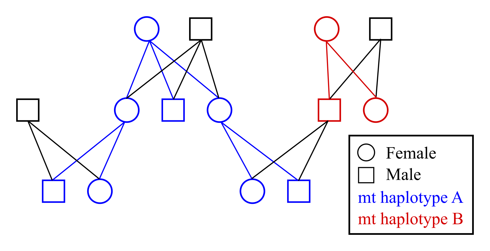

```{r setup, include=FALSE}
knitr::opts_chunk$set(echo = TRUE, eval=TRUE)
library(kableExtra)
```


## Why use mitochondrial data

Using data on the sharing of mitochondrial (mt) haplotypes makes it possible to distinguish between maternal/matrilineal and paternal/patrilineal relatives. For example, half-siblings sharing the same mother will always have the same mitochondrial haplotype, while half-siblings sharing the same father may have different haplotypes. Similarly, an individual always has the same mitochondrial haplotype as its maternal grandmother, but not (necessarily) as its paternal grandmother.

```{r diagram_ped, echo=FALSE, fig.cap="Example pedigree with colour coded mitochondrial haplotype inheritance", out.width="70%"} 
   
```


## Limitations

- Some paternal relatives may share the same mitochondrial haplotype, especially in small populations or if the population was founded by a limited number of females; 
- Mitochondrial haplotype sharing does not help distinguish between maternal half-siblings, full avuncular, and grand-parental pairs, and so when generations overlap the assignment rate may still be below 100%;
- It can be challenging to set a threshold between 'same' versus 'different' haplotypes, especially with a non-negligible genotyping error rate, limited number of polymorphic mitochondrial markers, and/or low call rate. The most conservative approach as input for `sequoia` is to set any uncertain pairs to 'same' (see next section). 


## Input

From package version 2.7 onwards, function `sequoia()` has the input parameter `mtSame`. This is a matrix with for each pair of individuals indicating whether they share the same mitochondrial haplotype (1) or have different haplotypes (0). 

The algorithm focusses on the differences: if two individuals $i$ and $j$ are close relatives according to the autosomal SNPs, and have different mitochondrial haplotypes (`mtsame[i,j]==0`), they cannot be maternal/matrilineal relatives, and thus must be paternal/patrilineal relatives. In contrast, if two individuals share the same mitochondrial haplotype (`mtsame[i,j]==1`), they may be maternal relatives, but it cannot be excluded that they are paternal relatives.

Therefore, if it is unclear or unknown whether two individuals share the same mitochondrial haplotype, this should be coded as `1` or `NA`, which is interpreted as 'may or may not be the same', while `0` is interpreted as 'definitely different' (= definitely not maternal relatives). 


```{r, echo=FALSE}
tbl <- matrix('OK', 3,3, 
              dimnames=list('mt hap' = c('same', 'different', '?'),
                            'related' = c('maternal', 'paternal', 'unrelated')))
tbl['different', 'maternal'] <- ' X'
tbl <- cbind(c('','mt haplotype', ''), rownames(tbl), tbl)
knitr::kable(tbl, row.names=F) %>%
  kable_styling(full_width = F) %>%
  column_spec(1:2, bold = T, border_right = F) %>%
  column_spec(3, color=ifelse(tbl[,3]==' X', 'red','black')) %>%
  add_header_above(c(" ", "", "Related" = 3))
#  collapse_rows(columns = 1, valign = "middle")  not working?
```


## Example

This example uses a single cohort from pedigree `Ped_HSg5`, which is included in the package. Both females and males have multiple mates, resulting in both maternal and paternal half-siblings as well as full siblings. We pretend here that none of the parents are genotyped, and that each breeding female has a unique mitochondrial haplotype. 

First, let us create a dataset for this example:
```{r sim_data}
library(sequoia)
# pedigree subset
id_subset <- as.character( LH_HSg5[LH_HSg5$BirthYear == 2001, 'ID'] )
Ped_sub <- Ped_HSg5[Ped_HSg5$id %in% id_subset,]

# assign a mitochondrial haplotype code to each founding female
founder_females <- as.character( LH_HSg5[LH_HSg5$BirthYear == 2000 & LH_HSg5$Sex==1, 'ID'] )
mtHaps_founders <- setNames( LETTERS[1:length(founder_females)], founder_females)
head(mtHaps_founders)

# infer mitochondrial haplotypes for all matrilineal descendants of individuals 
# with known haplotypes
source('https://raw.githubusercontent.com/JiscaH/sequoiaExtra/main/infer_mt_haplo.R') 
mtHaps_all <- infer_mt_haplotype(Ped_sub, mtHaps_founders)
mtHaps_all[41:50]

# add mitochondrial haplotype code to pedigree
Ped_sub$mt <- mtHaps_all[as.character(Ped_sub$id)]
head(Ped_sub)
```

The function `infer_mt_haplotype()` is not included in the package, but available from [](github.com/JiscaH/sequoiaExtra). It can also be used on real data, when mother-offspring relationships are reliably known, e.g. from behavioural observations, and only a subset of individuals is genotyped for mitochondrial markers. It infers haplotypes for both ancestors and descendants of individuals with known haplotypes, and then iterates a few times to infer haplotypes for all matrilineal relatives. 

Then, create the matrix with for each pair of individuals whether they have the same (1) or different (0) haplotype:

```{r mtSame}
mt_same <- outer(mtHaps_all, mtHaps_all, FUN = function(x,y) as.numeric(x==y))
mt_same[41:48, 41:48]
```


Simulate autosomal SNP data, with none of the parents genotyped:
```{r, cache=TRUE}
Geno_A <- SimGeno(Ped_sub, nSnp=500, ParMis=1, SnpError=1e-3)
```


Run sequoia with & without `mtSame` (note that these can take a couple minutes to run):

```{r seq, cache=TRUE}
SeqOUT_regular <- sequoia(Geno_A, LH_HSg5, quiet=TRUE)
SeqOUT_mt <- sequoia(Geno_A, LH_HSg5, mtSame = mt_same, quiet=TRUE)
```


Count number of half-siblings assigned in each run:
```{r}
RelM_regular <- GetRelM(SeqOUT_regular$Pedigree, patmat=TRUE)
table(c(RelM_regular))

RelM_mt <- GetRelM(SeqOUT_mt$Pedigree, patmat=TRUE)
table(c(RelM_mt))
```

Thus, without `mtSame` not a single half-sibling relationship is assigned, as it cannot be determined whether they are maternal or paternal half-siblings. In contrast, with `mtSame` hundreds of half-siblings are assigned.

In this example, the effect of `mtSame` on the number of individuals to which a dummy parent is assigned is negligible, as every individual has several full-siblings, and a dummy mother and father are assigned to each full-sibling cluster. Some additional full siblings are assigned: with default option `Complex = 'full'` the distinction between full siblings versus e.g. 'half siblings as well as cousins' (r=3/8) is not always clear, and the assignment of additional maternal and/or paternal half-siblings may clarify the full sibling relationships. 

For a graphical representation of these results you can run:

```{r, eval=FALSE}
PlotRelPairs(RelM_regular)
PlotRelPairs(RelM_mt)
```


